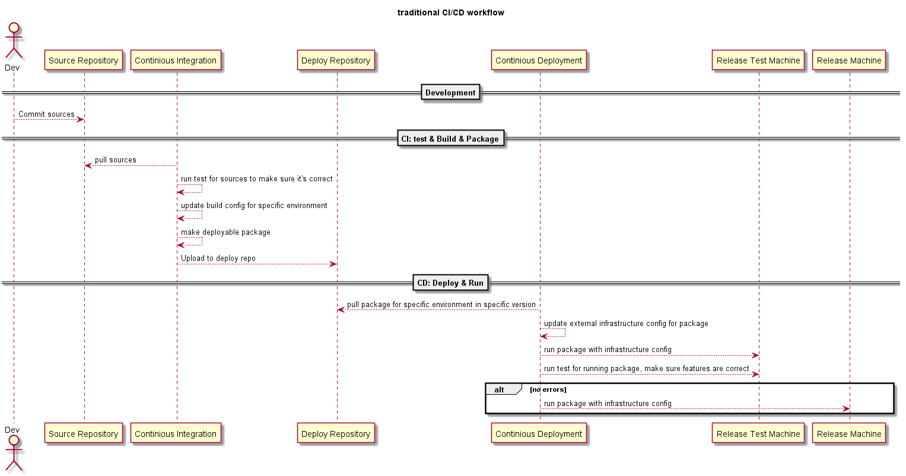

# 传统的CI/CD流程概述

## CI

CI的目的在于保证生成**可用的**包, 即能够满足以下的要求:

- 能够**正确**的生成包, 即没有任何编译错误
- 包针对具体的环境具有**通用性**, 即针对具体环境, 
不需要对功能配置进行更新的情况下任意部署
- 提供当前**版本要求的所有功能**
- 通过**测试**验证

### 测试

CI阶段的测试针对的是**包**的**自动化测试**, 一般包含:

- Unit Test
- Integration Test

CI阶段的测试用来验证该版本的修改是否对原有功能造成影响, 甚至产生错误.

### 功能配置的更新

CI阶段的配置更新用于保证提供版本要求的所有功能, 主要涉及以下几个方面:

- 包的版本设置
- 相关功能的开启和关闭
- 相同版本不同环境的功能策略的配置

该阶段的配置涉及的都是和包的功能切身相关的配置, 不包括外部服务以及基础设施的配置.

如果工程本身支持多环境的配置, 则可在那里进行分别配置, 
在CI阶段只要指定相应的环境, 然后进行打包即可.

## CD

CD阶段的目标是将包部署到相应的机器上, 并正确运行起来.

## 基础设施配置的更新

CD阶段的配置更新涉及以下的几个方面:

- 服务所依赖的基础设施的配置
    - LoadBalance(nginx, ...)
    - Database(MySQL, ...)
    - Cache(redis, ...)
- 依赖服务的相关配置
- 外部服务的相关配置

这块的配置往往取决于整体的架构设计.

由于部署环境的多变性, 所以这部分配置必须可以在部署阶段, 根据具体的环境进行配置.

往往同一个**可用区**的基础设施的配置是相同的.

## 可扩展的自定义配置

在基础配置的基础之上, 根据具体的环境对配置进行自定义.

**TODO**

## 测试

CD阶段的测试往往是**端到端**的**自动化测试**, 一般包含:

- 功能测试
- 压力测试

这部分的测试所针对的测试环境往往和正式环境一致

## 关于项目的配置

- 静态配置
    - 服务初始化时就要加载的功能配置, 往往加载后不会变化, 
    往往在项目中或CI阶段配置
    - CD阶段外部环境相关的配置, 在CD阶段进行配置
- 动态配置
    - 运行时可进行切换的功能配置, 在存储(DB, Cache)中配置, 可在运行时更新

## Reference

- [持续集成: 软件质量改进和风险降低之道](https://book.douban.com/subject/10769596/)