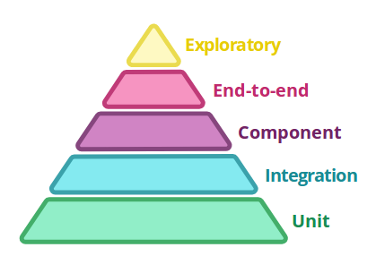
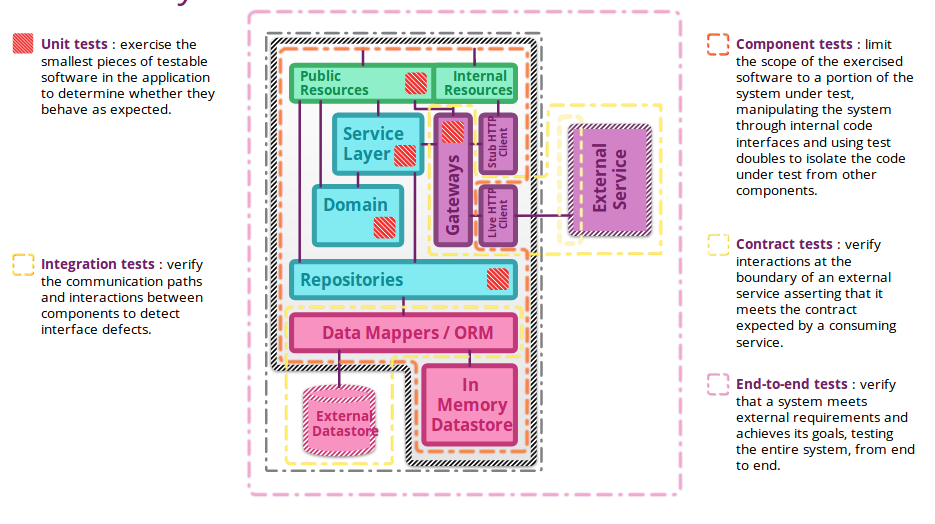

# 浅谈服务级的测试策略

## Unit Test

Unit Test是测试流程中**最小**的测试单元, 
用于**检验服务中模块的逻辑功能是否正确**, 
需要开发人员自己维护, 并且每次提交前必须保证所有Unit Test的正确.

- Sociable unit testing, 是一种**黑盒测试**, 
它所针对的模块往往是完整的业务流都能够在本模块中完成, 不依赖于外部模块.
所以开发人员只关心具体的输入, 是否能够得到预期的输出, 对模块中的完整的流程进行测试
这种测试的难点在于需要在设计时**明确模块的边界**, 减小对外部的依赖, 做好解偶.
- Solitary unit testing, 是一种**白盒测试**, 
它所针对的是模块需要和外部模块合作一同来完成业务流.
检验本模块相关的业务逻辑是否正确, 
会对外部的**依赖模块**进行**stub**, 来模拟外部依赖模块的正确返回值;
对于这种测试, 维护者需要知道业务逻辑是如何实现的, 才能进行合理的stub. 

维护人员:

- 开发人员
  - 测试用例, 针对服务模块

应用场景:

- 开发阶段, 检查新功能是否正确, 以及对已有功能是否产生影响
- CI, 检查所有模块是否正确, 保证服务的应用**包的正确性**

实现工具:

- xUnit系列, 例如JUnit

## Integration Test

用于检验对**外部依赖服务**的正确集成, 保证服务能够正确的使用外部依赖服务.

维护人员：

- 开发人员
  - 测试用例, 针对**外部依赖服务**的使用
  - 外部依赖服务的环境, 例如测试用MySQL, Redis等

应用场景:

- 开发阶段, 保证正确集成外部依赖, 能够供上层使用
- CI, 检验是否正确集成了外部依赖, 保证服务的应用**包的正确性**

实现工具:

- xUnit系列, 例如JUnit

## Component Test

在假设相关**外部依赖服务**完全正确的部署环境的前提下, 
对**整个服务**进行测试, 检验整个服务的功能正确性, 需要对外部依赖服务进行stub.

维护人员需要对系统的相关外部依赖进行stub, 来保证相关外部依赖能够返回正确的结果.

维护人员:

- 测试人员
  - 测试用例, 针对整个服务的功能
  - 相关外部依赖服务的stub, 可通过Contract Test来录制数据, 拥有stub的返回

应用场景:
  - CD, 检验服务在运行时能够提供正确的功能

实现工具:

- 集成测试工具, 例如Selenium, RobotFramework, TestNG等等
- WireMock, 用于搭建外部依赖的服务stub

## Contract Test

用于检验**外部依赖服务**的接口(契约)稳定性, 及时发现接口(契约)是否发生改变.

维护人员:

- 测试人员, 需要了解开发会使用哪些外部依赖服务的接口
  - 测试用例, 针对外部依赖服务的接口(契约)
  - 外部依赖服务的stub, 录制stub所需的数据

应用场景:
  - CD, 检查服务在运行时, 所依赖的外部服务的接口(契约)是否发生变化; 
  如果发生变化, 则及时通知到开发

实现工具:

- xUnit系列, 例如JUnit等
- WireMock, 用于录制stu所需要的数据

## End-to-End(E2E) Test

用于测试在**真实部署环境**下, 测试**整个服务**在与外部依赖服务**真实集成**后, 
整个服务提供的功能是否正确.

和Component Test的区别在于, End-to-End Test会使用真实的外部依赖服务, 
而不是stub.

维护人员:

- 测试人员
  - 测试用例, 针对整个服务的功能

应用场景:
  - CD, 检验整个服务的功能的正确性

实现工具:

- 集成测试工具, 例如Selenium, RobotFramework, TestNG等等

## Summary

测试策略的选择因素:

- 项目的大小
- 测试策略的价值

项目从小到大时, 为保证项目的质量, 引入的测试策略的参考顺序:

1. Unit Test
2. E2E Test
3. Integration Test
4. Contract Test
5. Component Test

测试金字塔两端的测试(Unit Test和E2E Test)的价值往往是最大的, 所以一般在一开始就引入.

## Reference

- [Testing Strategies in a Microservice Architecture](https://martinfowler.com/articles/microservice-testing/)
- [Richardson Maturity Model](https://martinfowler.com/articles/richardsonMaturityModel.html)
- [Understanding HATEOAS](https://spring.io/understanding/HATEOAS)
