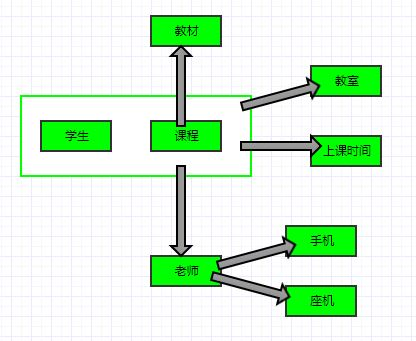

# Schema与数据类型优化

## 数据类型的选择

MySQL基础数据类型

- 数字
    - 整数
        - tinyint/smallint/mediumint/int/bigint
        - unsigned可选
    - 实数
        - Float/Double, 浮点计算
        - DECIMAL, 存储精确的小数, 一般可使用bigint来代替decimal, 通过乘以相应的倍数即可
- 字符串
    - char, 定长, 适合更新频繁的列或者长度固定的列
    - varchar, 变长, 需要额外的1或2个字节来存储长度, 小于等于255则1个字节, 大于则2个字节; 不适合更新频繁的列, 会导致碎片化
    - text, 很长的字符串
- 二进制字符串, 比较时以**字节**为单位进行比较, 效率要比普通字符串要高
    - binary, 定长
    - varbinary, 变长
    - blob, 很长的二进制字符串
- 时间
    - datetime, 从1001到9999年, 精度为秒, 把日期和时间封装到格式为**YYYYMMDDHHMMSS**的**整数**中, 显示**与时区无关**, **使用8字节存储**
    - timestamp, 同unit时间戳, 从新纪元时间(1970-01-01T00:00:00)以来的秒数, **使用4字节存储**, 只能表示1970到2038年, 显示依赖于时区, 会根据时区不同, 显示对应的时间; 对应的列默认为NOT NULL.

### 特殊数据类型的处理

**uuid**数据的处理:

1. 移除uuid中的**-**
2. 使用unhex函数将uuid字符串转换为16字节的数字, 存储到binary(16)中
3. 使用hex函数将16字节的数字转换为uuid字符串

```
mysql> select uuid();
+--------------------------------------+
| uuid()                               |
+--------------------------------------+
| e8dc60bb-6df3-11e8-8915-0800273063ab |
+--------------------------------------+
1 row in set

mysql> select unhex('e8dc60bb6df311e889150800273063ab');
+-------------------------------------------+
| unhex('e8dc60bb6df311e889150800273063ab') |
+-------------------------------------------+
| ��`�m��
+-------------------------------------------+
1 row in set

mysql> select hex(unhex('e8dc60bb6df311e889150800273063ab'));
+------------------------------------------------+
| hex(unhex('e8dc60bb6df311e889150800273063ab')) |
+------------------------------------------------+
| E8DC60BB6DF311E889150800273063AB               |
+------------------------------------------------+
1 row in set

```

---

**ip**数据需要转换为数字存储:

1. 使用**无符号整数**存储ip列
2. 使用inet_aton将ip字符串转换为整数
3. 使用inet_ntoa将数字转换为ip字符串

```
mysql> select inet_aton('192.168.0.1');
+--------------------------+
| inet_aton('192.168.0.1') |
+--------------------------+
|               3232235521 |
+--------------------------+
1 row in set

mysql> select inet_ntoa(3232235521);
+-----------------------+
| inet_ntoa(3232235521) |
+-----------------------+
| 192.168.0.1           |
+-----------------------+
1 row in set

```

---

**id列**的数据类型尽量选择**递增型整数**

因为随机值会分布在很大的空间中, 导致insert和select变慢.
而且随机值的插入会随机写到索引的不同位置, 导致insert语句变慢;
由于数据分布在很大的空间中, 也就导致了select指定的数据会变慢;
还会导致缓存失效.

**由于InnoDB的索引是一个B+Tree, 所以按顺序的插入能够保证数据很快插入, 
并保证数据集中在一定的范围之内. 递增插入是比较好的选择.**

不建议使用字符串类型作为id列, 查询性能很差.

一般情况下尽量使用默认值方案来替换NULL, 因为NULL会增加查询的复杂度.

## Schema的设计

### 范式与反范式

范式的主要目的:

- 减少数据冗余
- 消除插入/删除/更新的异常

关键概念:

- 码/键(候选码), 表中的一个或多个属性组K, 除开K中的属性外的其他所有属性都完全函数依赖于K, 则K为候选码; 一个表可能存在多个码
- 主属性, 包含在各个候选码中的属性, 主属性不可为空

通常使用的范式:

- 1NF(Normal Form)第一范式, 属性的原子性保证不可再分割, 每个属性都只能存储一个值
- 2NF第二范式, 基于1NF, 定义候选码, 非主属性必须**完全依赖**于候选码, 即通过候选码可以确定实体的唯一性
- 3NF第三范式, 基于2NF, 消除**传递依赖**, 即任何非主属性不能由其他属性派生, 要求**属性没有冗余**
- BCNF, 基于3NF的改进范式, 消除**主属性对码的部分与传递依赖**

一般情况下, 关系型数据库的表设计只要达到**3NF/BCNF**就够了.


```
// 不符合1NF, 电话列可继续拆分
学生|课程|老师|电话(手机, 座机)|教材|教室|上课时间 

// 符合1NF, 候选码为(学生, 课程), 但不符合2NF, 教材只部分依赖于主键列中的课程
学生|课程|老师|手机|座机|教材|教室|上课时间 

// 符合2NF, 但不符合3NF, (学生, 课程) => 老师 => 手机|座机, 存在传递依赖
学生|课程|老师|手机|座机|教室|上课时间

课程|教材

// 符合3NF
学生|课程|老师|教室|上课时间

课程|教材

老师|手机|座机

```

上面例子中的关系图:



针对**写密集**的场景尤其需要对schema进行范式化, 而针对读密集的场景可以使用反范式.

范式化的表能够更好更快的进行更新操作, 但是查询往往需要多表join; 
然而单独的表能够更有效的利用索引.

### 缓存表 && 汇总表

通过缓存表和汇总表来缓存源数据经过逻辑计算后的冗余数据, 可以提升相应业务逻辑场景的查询性能.

- 非实时性数据, **定时**计算更新的不严格计数
- 实时性数据, 通过**小范围查询填满间隙**的严格计数

在使用缓存表和汇总表时, 对数据的维护有两种方式:

- 实时维护, 成本较高, 数据容易碎片化
- 定期重建, 可以保持表不会有很多碎片, 而且能保证顺序组织索引, 更加高效

重建表可以通过**影子表**的技巧

1. 创建相同结构的新表, `create table test_table_new like test_table`
2. 填充数据, 数据有可能时老数据, 也可能时重新整理后的数据
3. 通过重命名来交换新表和旧表的名字, `rename table test_table to test_table_old, test_table_new to test_table`
4. 如果出问题了, 可以很容易回滚旧表

### 计数表

为了提升技术表的并发处理能力, 在更新时随机到相应的slot行插入, 查询时汇总结果.

```
-- 多slot的计数表

create table if not exists counter_tb (
slot tinyint unsigned not null primary key, 
cnt int unsigned not null
) engine=InnoDB default charset=utf8mb4;

-- 更新时随机slot更新
insert into counter_tb (slot, cnt)
values (rand() * 10, 1)
on duplicate key update cnt = cnt + 1;

-- 查询时汇总

select * from counter_tb;

select sum(cnt)
from counter_tb;
```

### schema的修改

MySQL中大部分执行alter table来修改表结构的操作都会导致重建表, 即用新的结构创建新表, 将旧表数据导入新表, 最后删除旧表.
这对大表来说需要花费很大的时间和代价.

大部分的alter table操作都会导致MySQL服务中断.
对于在生产环境中修改表结构, 一般可采用以下方法:

- 在备用数据库上修改结构后, 和主库进行切换
- 影子拷贝, 操作同创建影子表的操作; 也可借助一些第三方工具来进行影子拷贝

.frm文件存储着表的结构, 它存放在mysql的data目录下对应的schema目录里, 默认的data目录为/var/lib/mysql.
以下情况可通过修改**.frm文件**的结构来更新表结构, 但对.frm文件的修改存在风险, 需要做好备份:

- 列的默认值
- NULL/NOT Null

## Reference

- [Demo](https://github.com/xiayy860612/example/tree/master/mysql_demo/schema)
- [高性能MySQL](https://book.douban.com/subject/23008813/), 第4章 Schema与数据类型优化
- [解释一下关系数据库的第一第二第三范式](https://www.zhihu.com/question/24696366)
- [数据库设计三大范式与BCNF，学习笔记](https://www.cnblogs.com/ybwang/archive/2010/06/04/1751279.html)