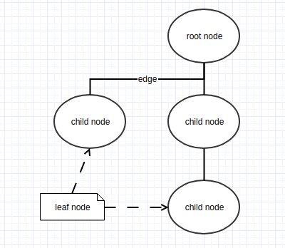

# 树 && 二叉树

树的组成:

- 节点(node)
  - 根节点(root)
  - 子节点(child)
    - 叶节点(leaf)
- 边(edge)

树的路径是指一个节点到另一个节点之间的节点序列, 路径的长即为两个节点间的边的条数

节点的深度是指从根节点到指定节点的唯一路径的长.

节点的高是指从指定节点到树叶的最长路径的长.

树的应用:

- 分层文件系统

树的遍历:

- 前序遍历(pre-order), 先处理当前节点, 然后处理子节点, 最后兄弟节点
- 后序遍历(post-order), 先处理子节点, 然后当前节点, 最后兄弟节点

## 二叉树

- 每个节点最多2个子节点
- 二叉树的平均深度要比节点个数小的多, 为O(N的平方根)

二叉树查找树的运行时间为**O(logN)**

应用:

- 编译器
- 表达式二叉树

二叉树的遍历:

- 中序遍历(inorder), left, current, right
- 后序遍历(post-order), left, right, current
- 前序遍历(pre-order), current, left, right

