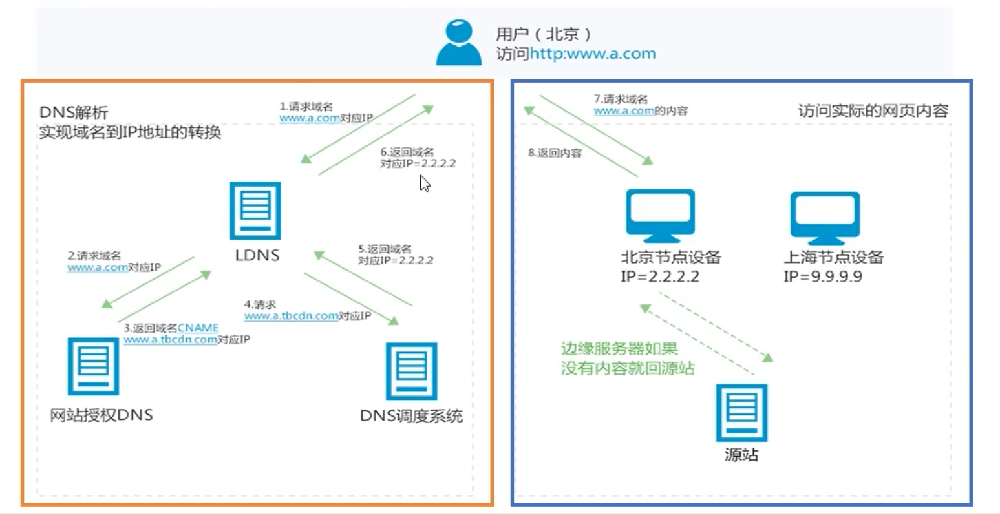

# 阿里云 CDN

好处:

- 网站加速
- 资源分布式缓存

阿里云CDN:

- https安全加速
- 支持OSS, IP, 自定义域名的回源
- 性能优化
- 视频优化
- 刷新缓存
    - URL刷新
    - 目录刷新
    - URL预热
- 资源监控

使用OSS作为源站, OSS用于存储上传数据;
CDN提供CDN节点, 缓存OSS源站的内容.

## OSS

- 可使用ACL对存储桶进行基本读写权限设置
- 可使用RAM子账号提供对资源访问控制
- 通过 Delimiter 和 Prefix 参数的配合模拟出文件夹功能

## CDN

- 可设置RAM子用户对CDN资源的访问权限进行管理
- 

---
[Aliyun OSS]: https://help.aliyun.com/product/31815.html
[Aliyun CDN]: https://help.aliyun.com/product/27099.html