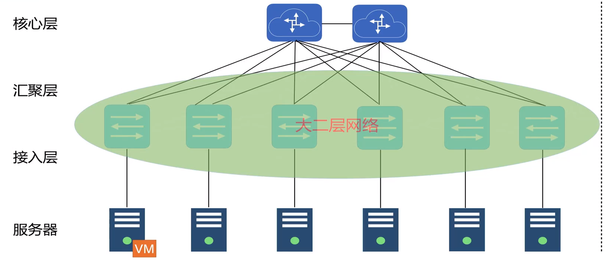

# 阿里云专有网络VPC

网络模型

- OSI七层网络
- TCP/IP五层网络

- 交换机(switch), 一般是用在第二层数据链路层, 识别MAC地址, 不能划分子网
- 路由器(Router), 一般用在第三层网络层, 识别IP, 可用于划分子网
- 动态IP(EIP), 提供对公访问的ip

使用VLAN来划分子网.

传统网络的三层路由/二层交换

云网络的大二层网络

VPC基于**隧道技术**来进行隔离.

## 迁移策咯

- 混挂和混访
    - 混挂, 一个SLB下可以挂在经典网络的ECS, 也可以挂在VPC专有网络的ECS
    - 混访, VPC专有网络下的ECS可以访问经典网络下的RDS和OSS
- 单ECS迁移, 从经典网络迁移到VPC专有网络
- ClassicLink, 建立经典网络到VPC专有网络的通信

## 网络访问

从VPC访问公网:

- 分配公网IP
- 绑定EIP
- 配置NAT网关

从公网访问VPC:

- 分配公网IP
- 绑定EIP
- 端口映射
- 配置公网负载均衡

VPC互连:

- 高速通道VPC连接
- VPN网关部署

VPC和IDC互连:

- 高速通道专线接入
- VPN网关

阿⾥云使⽤ VXLAN 技术，在虚拟网络层实现隔离.

添加⼀条指向对端的 IPSec VPN 隧道，通过此隧道，实现两个隔离环境的端对端连通。
这样的技术，不仅可以保证两个环境对外的安全隔离，也可以实现两个环境中的数据交互。

使⽤ FlexGW，开始进⾏ VPN 的配置

