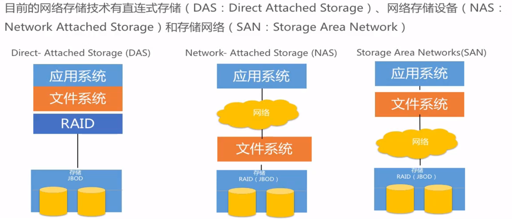

# 阿里云 --- 存储

RAID, 独立磁盘冗余阵列, 多块硬盘通过某种形式形成一定的数据冗余,
这样当一块或多块硬盘损坏时, 数据还能依靠冗余保存下来, 不至于丢失.

- RAID 0, 迅速读写, 安全性低
- RAID 1, 随机数据写入, 安全性高
- RAID 3, 连续数据传输, 安全性高
- RAID 5, 随机数据传输, 安全性高

备份方式:

- 增量备份
- 全量备份

灾备:

- 同城灾备, 比较进行数据同步, 保证数据完整性和数据零丢失, 但无法避免自然大灾害
- 异地备份, 异地数据同步效率低下, 无法保证数据零丢失, 但可以避免自然大灾害
- 两地三中心, 结合**同城+异地**的优点, 是目前灾备系统的最佳实践

## OSS

每个文件都是一个**Object**, 是OSS存储数据的基本单元, 每个Object包含key, data和meta data信息.

Object操作在OSS上具有原子性，操作要么成功要么失败，不会存在有中间状态的Object。OSS保证用户一旦上传完成之后读到的Object是完整的

Object都存储在**Bucket**中, Bucket在整个OSS中全局唯一且不可修改.

上传方式:

- 客户端上传
    - 简单上传, 不支持断点续传，适合用于上传小文件
    - 表单上传
    - 断点续传
    - 追加上传
- 服务器上传, 上传走的内网, 不收取费用
    - 简单上传
    - 断点续传
    - 追加上传

通过在querystring中添加**x-oss-process**来进行图片处理.