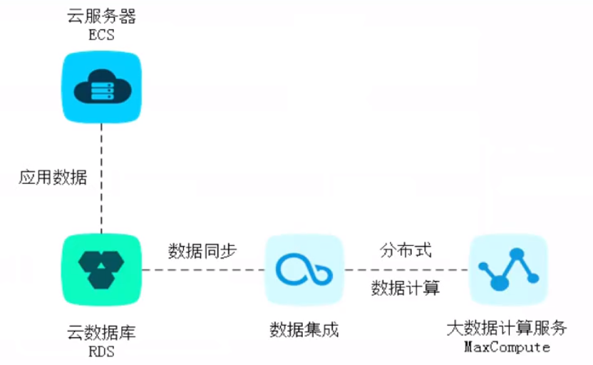

# 阿里云 --- RDS

MySQL的相关架构

- 单机的**存储与计算分离架构**
- 双机的**一主一备**热备架构
- **一主两备**三节点架构, 通过日志多副本同步复制来确保数据的强一致性

RDS提供两种连接地址: **内网地址和外网地址**,
两种访问模式: **标准模式和高安全模式**

**云上同一个地域**的实例可以使用内网地址访问

使用多可用区来达到同城灾备

通过使用**DMS**来管理阿里云RDS

使用**DTS**来对数据进行迁移:

- 结构迁移
- 全量数据迁移
- 增量数据迁移

RDS数据同步方式:

- 半同步, 主库数据修改后, 会在保证数据同步到一定数量的备库后, 返回响应, 增加响应时间.
- 异步, 主库数据修改后, 立即返回响应, 不关心数据是否已经同步到备库. 如果主库宕机, 备库无法保证数据一致性.
