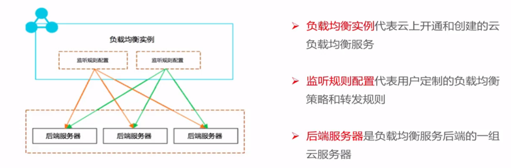
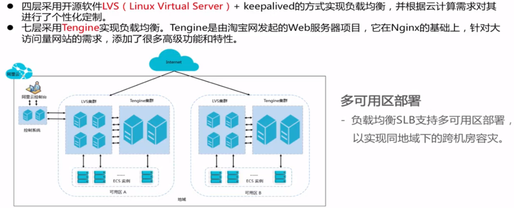

# 阿里云负载均衡SLB

- SLB实例
- 监听规则
- 后端服务器

SLB提供的功能:

- 支持公网和私网的负载均衡
- 4层和7层的负载均衡服务
- 调度方式
    - 轮询模式, 依次转发给后端服务器
    - 最小连接数模式, 转发给最小连接数的后端服务器
    - 加权轮询, 根据后端权重来转发
- 会话保持
- 健康检查
- 单个实例同城灾备, 已经部署在同地域的不同可用区

