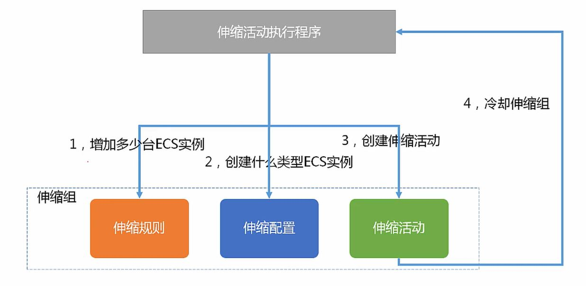

# 阿里云---弹性伸缩ESS

弹性伸缩的资源:

- 服务器
- 网络
- 存储

弹性伸缩的扩展方式:

- 垂直扩展, 提升硬件配置
- 水平扩展, 增加单机的数量

弹性伸缩的优势:

- 自动化
- 节约成本
- 容错性

## 阿里云的弹性伸缩ESS

伸缩模式:

- 定时模式
- 动态模式, 通过监控资源阈值
- 固定数量模式
- 健康模式, 移除不健康的ECS, 加入健康的ECS
- 自定义模式
- 多模式并行

阿里云的弹性伸缩可对**ECS**进行弹性伸缩:

- 伸缩组, 具有相同应用场景的ECS实例的集合, 一般还需要关联对应的SLB和RDS.
- 伸缩配置, 伸缩时的ECS实例的配置, 配置后不可修改; 只能重新创建并激活新的伸缩配置
- 伸缩规则, 定义了具体的扩展或收缩的ECS数量
- 伸缩活动：伸缩规则成功出发后，就会产生一条伸缩活动, 主要描述伸缩组内ECS实例的变化情况
- 伸缩触发任务
    - 定时任务, **定时**来进行弹性伸缩
    - 报警任务, 通过**监控资源的阈值**来进行弹性伸缩
- 冷却时间：在同一伸缩组内，一个伸缩活动执行完成后的一段锁定时间。在这段锁定时间，该伸缩组不执行其他的伸缩活动.
    - 伸缩组冷却时间, 只会拒绝报警任务的伸缩活动请求
    - 伸缩规则的冷却时间

冷却时间的优先级:

1. 伸缩规则
2. 伸缩组

所有通过弹性伸缩服务创建的ECS实例，均以**ESS- 为前缀命名**，便于和通过控制台手动创建的ECS进行区分。

