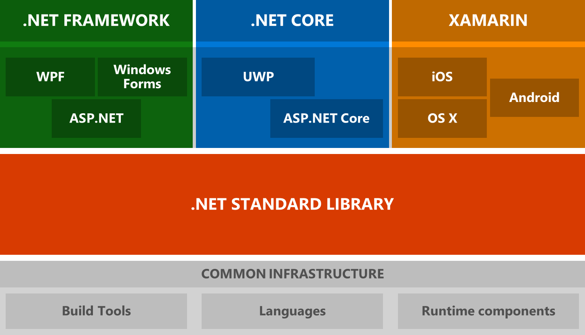

# .Net Introduction

学习[.Net](https://docs.microsoft.com/zh-cn/dotnet/articles/standard/)
<!--more-->

.Net Standard定义了一套正式的.NET API规范, 由.NET CLR实现.
由[ECMA 335](http://www.ecma-international.org/publications/standards/Ecma-335.htm)持续为 .NET 运行时行为建立统一性.

目前有3套.Net CLR都实现了这个标准库
- .Net Framework
- .Net Core
- Mono for Xamarin

 每个.NET CLR版本将会公布它所支持的最高.NET Standard版本，这种声明意味着它也支持以前的版本。

基类库 BCL 提供最基本的类型和实用工具功能，是其他所有 .NET 类库的基础。

.NET 二进制格式以 [Windows PE](https://en.wikipedia.org/wiki/Portable_Executable) 文件格式为基础。

每一个包都代表着单独的同名程序集。元包是指通常配合在一起使用的一组包。

Use [MSBuild](https://docs.microsoft.com/zh-cn/visualstudio/msbuild/msbuild) to build .net core project.

