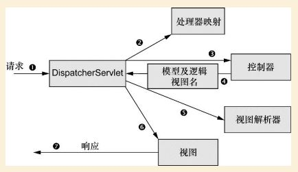

# Spring MVC 基础

在Spring MVC框架中请求在DispatchServlet, HandlerMapping, Controller和View Resolver之间移动.

Spring MVC中的所有请求都会通过FrontController Servlet(DispatchServlet), 
FrontController是常用的Web应用程序模式.

通过HandlerMapping来查询请求的Handler/Controller, 一般根据请求的**URL信息**来进行决策.

设计良好的Controller只处理很少甚至不处理工作, 会将业务委托给一个或多个Service进行处理.

## DispatchServlet

**AbstractAnnotationConfigDispatcherServletInitializer**接口的任意实现用来
配置DispatchServlet以及Spring Application Context.

1. 在Servlet 3.0容器环境中, 容器会通过classpath来查找**javax.servlet.ServletContainerInitializer**接口的实现, 用于配置Servlet容器.
2. Spring提供了**SpringServletContrainerInitializer**实现了ServletContainerInitializer接口, 在这个类中通过查找**WebApplicationInitializer**接口的实现, 用它来配置Servlet容器.
3. Spring 3.2引入了WebApplicationInitializer的一个实现**AbstractAnnotationConfigDispatcherServletInitializer**
4. Spring Boot也引入了WebApplicationInitializer的一个实现**SpringBootServletInitializer**

Spring Web启动时会创建两个Application Context:

- 一个由DispatchServlet创建ServletContext, 用于加载包含Web组件中的bean, 例如Controller, HandlerMapping, View Resolver等
- 一个由ContextLoaderListener创建RootApplicationContext, 用于加载应用中的其他的bean.

WebApplicationInitializer的实现会负责创建DispatchServlet和ContextLoaderListener

- 

