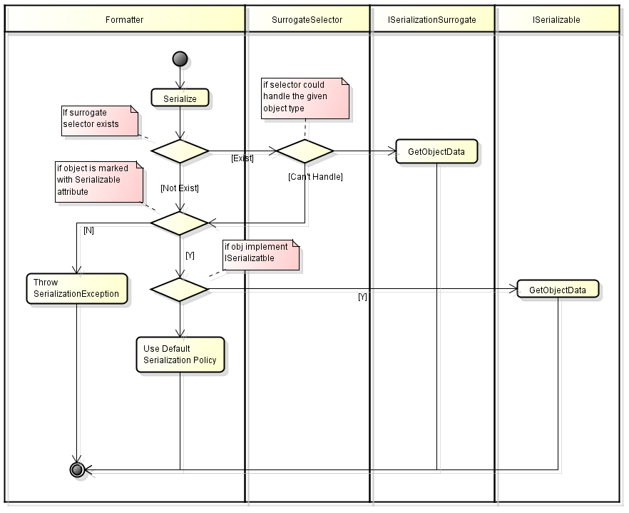

# C# Serialization

Serialization is used to allow data to be easily stored and transferred.

It has tow directions
- Serialize, convert object into formatted data
- Deserialize, convert formatted data into object

Remoting uses serialization to pass objects "**by value**"
from one computer or application domain to another.
<!--more-->

3 kinds of serialization tech:
- [Data Contract Serialization][Data Transfer and Serialization]
    + Persist Storage
    + Web Services
- [XML Serialization][]
    + XML construct required
    + open standard env
- Runtime Binary Serialization
    + Across .Net Boundaries

## Runtime Binary Serialization
- Marshal-By-Value, object is marked as **Serializable** attribute,
transfer copy of object
- Marshal-By-Reference, object derives from **MarshalByRefObject**,
transfer object reference, not object itself.

Serialization needs an instance of **stream** and **formatter**.

    [Serializable]  
    public class MyObject {  
        public int n1 = 0;  
        public int n2 = 0;  
        public String str = null;  
    }

    MyObject obj = new MyObject();  
    obj.n1 = 1;  
    obj.n2 = 24;  
    obj.str = "Some String";  
    IFormatter formatter = new BinaryFormatter();  
    Stream stream = new FileStream("MyFile.bin", FileMode.Create, FileAccess.Write, FileShare.None);  
    formatter.Serialize(stream, obj);  
    stream.Close();  

Serializable attribute cannot be inherited.
If you derive a new class from a Serializable class,
the new class must be marked with the attribute as well, or it cannot be serialized.

Security-sensitive data shoud not be serialized,
if object must be serialized, mark **NonSerialized** attribute to security-sensitive fields,
so the fields won't be serialized during object serialization.

### Custom Serialization
Custom Serialization is able to serialize and deserialize
between versions of a type without breaking the core functionality of the type.

These are 2 ways for custom serialization.
- (**recommended**)Implement **ISerializable**
    + ISerializable::GetObjectData, used to serialize
    + constructor(SerializationInfo, StreamingContext), used to deserialize
- Implement **ISerializationSurrogate** for non-serializable class
and add into **SurrogateSelector** of formatter.
    + ISerializationSurrogate::GetObjectData
    + ISerializationSurrogate::SetObjectData

Mark **OptionalField** attribute for not-required fiels,
when missing the data of these fields it won't throw exception.

Use Serialization Callbacks to hook into
serialization/deserialization process at four points.
- OnDeserializingAttribute, before deserialization
- OnDeserializedAttribute, after deserialization
- OnSerializingAttribute, before serialization
- OnSerializedAttribute, after serialization

## Data Contract Serialization
- DataContractAttribute
- DataMemberAttribute

Use **DataContractSerializer** for Data Contract Serialization.

It serializes all publicly visible types for class not anotated
with DataContract explicitly.

if a serializable class include a abstract member which could be assigned
with its subclass, mark **KnownTypeAttribute** with subclass
for this serializable class.

    // The KnownTypeAttribute specifies types to be
    // used during serialization.
    [KnownType(typeof(USAddress))]
    [DataContract]
    class Person4
    {

        [DataMember]
        string fullNameValue;
        [DataMember]
        Address address; // Address is abstract

        public Person4(string fullName, Address address)
        {
            this.fullNameValue = fullName;
            this.address = address;
        }

        public string FullName
        {
            get { return fullNameValue; }
        }
    }

    [DataContract]
    public abstract class Address
    {
        public abstract string FullAddress { get; }
    }

    [DataContract]
    public class USAddress : Address
    {

        [DataMember]
        public string Street { get; set; }
        [DataMember]
        public string City { get; set; }
        [DataMember]
        public string State { get; set; }
        [DataMember]
        public string ZipCode { get; set; }

        public override string FullAddress
        {
            get
            {
                return Street + "\n" + City + ", " + State + " " + ZipCode;
            }
        }
    }

## XML Serialization
XML serialization serializes only **public** fields and property values.
XML serialization does not include type information.

Mostly use [XSD][] to descript structure of XML Document.

It uses **XmlSerializer** class for XML Serialization.

### XML Serialization Controlling
Use **XML Attributes** to control XML Serialization
- XmlElement
- XmlArray
- XmlArrayItem
- XmlRoot
- XmlType, declare type attribute in XSD file.
- XmlIgnore, ignore field during serialization

When a field could be assigned by different kinds of type,
it should set **Type** property of XML Attribute with each type.

    public class Group{  
        [XmlArrayItem(Type = typeof(Employee)),  
        XmlArrayItem(Type = typeof(Manager))]  
        public Employee[] Employees;  
    }  
    public class Employee{  
        public string Name;  
    }  
    public class Manager:Employee{  
        public int Level;  
    }  

Use [**SOAP XML Attribute**](https://msdn.microsoft.com/en-us/library/b29kkt2s.aspx) for SOAP XML Serialization.

---
[Serialization]: https://msdn.microsoft.com/en-US/library/7ay27kt9(v=vs.110).aspx
[XML Serialization]: https://msdn.microsoft.com/en-us/library/90c86ass(v=vs.110).aspx
[Data Transfer and Serialization]: https://msdn.microsoft.com/en-us/library/ms730035(v=vs.110).aspx
[XSD]: http://w3school.com.cn/schema/index.asp
