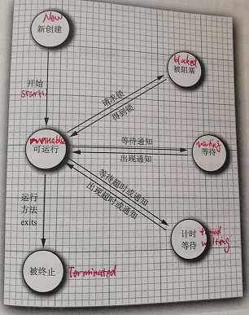

# 多线程基础

java.util.concurrent里提供了很多用于并发的组件.

可以传递给Thread进行异步执行的对象:

- Runnable, 用于封装**没有参数和返回值**的异步方法
- Callable, 用于封装**没有参数, 但有返回值**的异步方法
- Future, 保存了异步方法执行的**状态和结果**
- FutureTask, 实现了Future和Runnable的接口, 可用来转换Callable到Runnable

Thread的6种状态变化



一个runnable状态的线程可能正在运行, 也可能没有运行.

实现**UncaughtExceptionHandler**接口, 
然后可以通过**setUncaughtExceptionHandler**方法为线程指定异常处理器.
也可以通过**Thread.setDefaultUncaughtExceptionHandler**为所有线程设置默认的异常处理器.

## 同步

如果多个线程同时对某个数据进行请求, 则会产生**竞争条件**, 
此时就需要通过同步的手段来使这些请求串行化处理.

Java的每个对象都有一个内部锁, 并且该锁有一个内部的条件变量.

Java的同步策咯:

- 锁
    - synchronized方法, synchronized使用的就是对象的内部锁
    - ReentrantLock
    - condition variable条件变量
- 同步阻塞, synchronized到对象, 显式加锁, 尽量保证锁的范围尽可能小
- 监视器
- 原子操作, java.util.concurrent.atomic提供了很多原子操作的工具
- java.util.concurrent提供了线程安全的集合

任何集合类可以通过使用**Collections.synchronizedXXX**同步包装器方法变成线程安全.
但尽量使用java.util.concurrent提供的线程安全的集合, 而不是使用同步包装器方法.

```
List<E> list = Collection.synchronizedList(new ArrayList<E>());
Map<K, V> map = Collection.synchronizedMap(new HashMap<K, V>());
```

## 线程池

通过Executor执行器来创建线程池, 返回ExecutorService.

- newCachedThreadPool, 只在必要时创建新线程; 空闲线程只会保留一定时间后释放
- newFixedThreadPool, 固定数量的线程
- newScheduledThreadPool, 预定时间执行的固定线程池, 用来替代Timer来处理定时任务

当调用ExecutorService.shutdown时, Executor不再接受新任务, 等所有已存在的任务执行完毕后, 释放所有线程;
而shutdownNow则会立即中断所有正在执行的线程.

## Fork-Join 框架

Java7 引入了Fork-Join框架.

Java8的stream流处理的底层并发框架默认使用Fork-Join框架.

Fork-Join使用work stealing工作窃取的方法来平衡可用线程的工作负载.

