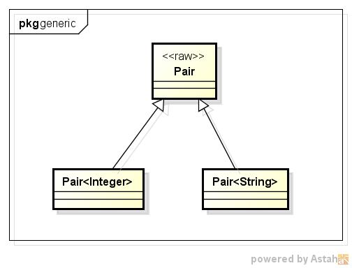
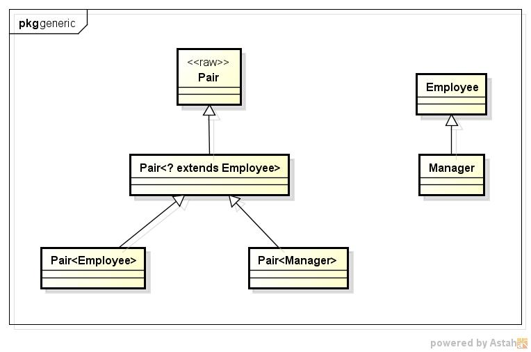

# Java --- Generic泛型

泛型的好处:

- 更好的可读性
- 更好的安全性

泛型的类型参数使的程序具有更好的可读性和安全性.

**类型变量是泛型的固定类型, 用来指示泛型中所使用的具体类型.**

泛型方法的**类型变量**放在**修饰符的后面, 返回类型的前面**.

```
class ArrayAlg {
    public static <T> getMid(T arg) {...}
}

// 调用时, 在方法名前的尖括号中放入具体的类型
ArrayAlg.<String>getMid("hello");
// 同上, 编译器有足够信息进行类型推断
ArrayAlg.getMid("hello");
```

类型变量的限定

```
// 单个限定
T extends Type1

// 多个限定
T extends Type1 & Type2
```

Java的继承中, 类型变量可以有多个接口类型, 但最多只能有一个类.
如果用类作为限定, 必须放在限定列表第一个.

Java虚拟机没有泛型类型对象, 都是普通类.

Java通过**类型擦除**的方式提供对泛型的支持.

当定义一个泛型类型时, 都会产生一个相应的**原始类型(raw type)**, 
原始类型就是删去类型参数后的类型名, 擦除类型变量并替换为**限定类型**, 
如果没有限定类型, 则使用Object作为限定类型.

```
// Java定义的类型
@Getter
@Setter
public class Pair<T> {
    private T first;
    private T second;

    public Pair() {
        this.first = null;
        this.second = null;
    }
    public Pair(T first, T second) {
        this.first = first;
        this.second = second;
    }
}

// jvm生成的原始类型
public class Pair {
    private Object first;
    private Object second;

    public Pair() {
        this.first = null;
        this.second = null;
    }
    public Pair(Object first, Object second) {
        this.first = first;
        this.second = second;
    }

    ...
}
```

类型擦除会与多态发生冲突, 一般需要通过**桥方法**来解决.

```
// 下面的代码作为Pair<Int>在虚拟机中的代码参考
public class IntPair extends Pair {

    public void setSecond(Integer second) {
        super.setSecond(second);
    }

    /**
     * 通过桥方法来调用类本身对应的方法
     * @param second
     */
    @Override
    public void setSecond(Object second) {
        this.setSecond((Integer)second);
    }

    /**
     * 擦除返回类型, 编译器强制插入类型转换
     * @return
     */
    @Override
    public Integer getSecond() {
        return (Integer) super.getSecond();
    }

    ...
}
```

Java中是通过**方法名+参数类型**来确定一个方法,
而jvm中是通过**方法名+参数类型+返回类型**来确定一个方法

Java中的泛型设计是编译器以**继承原始类型+桥方法**的方式实现的, 
而C#和C++中的泛型是直接生成对应的类型代码.



jvm中的对象总是一个特定的非泛型类型, jvm中不存在泛型类型,
所有运行时对泛型类型的getClass查询只会返回原始类型.

## 通配符类型

通配符类型中, 允许类型参数变化, **通配符?**不能用来作为固定类型来匹配.



使用通配符类型, 编译器无法知道传递的具体类型, 只知道是通配符的限定类型的子类.

**带有超类型限定super的通配符可以向泛型对象写入,
带有子类型限定extend的通配符可以从泛型对象读取.**

可以使用类型变量来捕获通配符, 
编译器必须能够确定通配符表达的是**单个, 确定**的类型, 才能保证类型变量捕获通配符.


