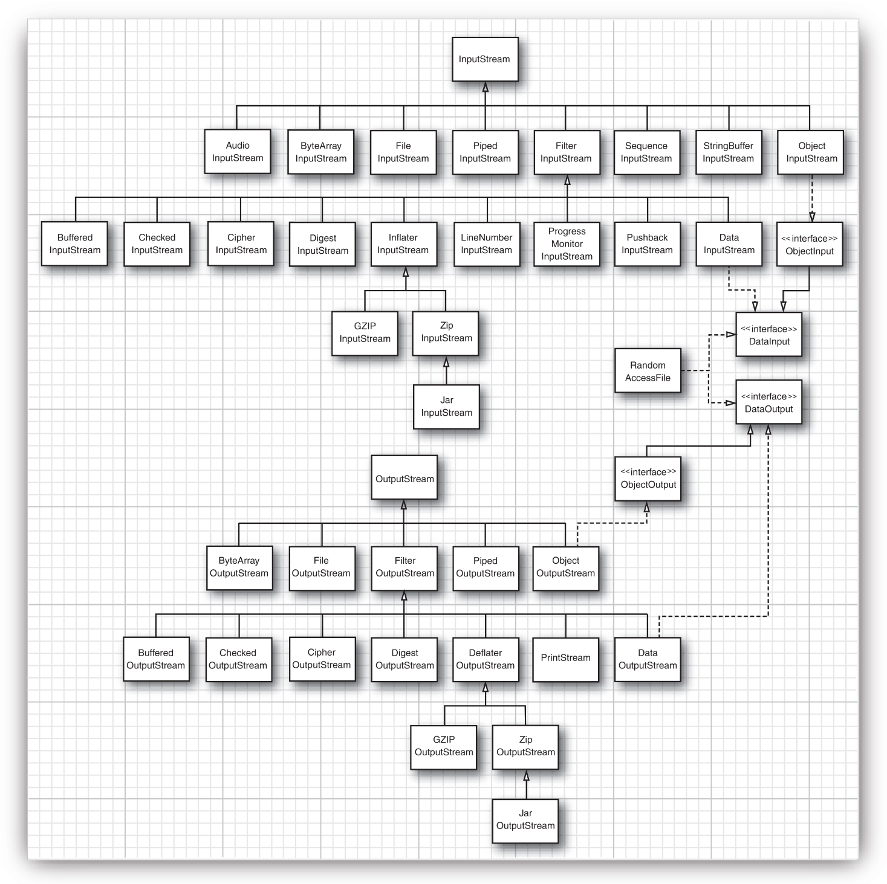
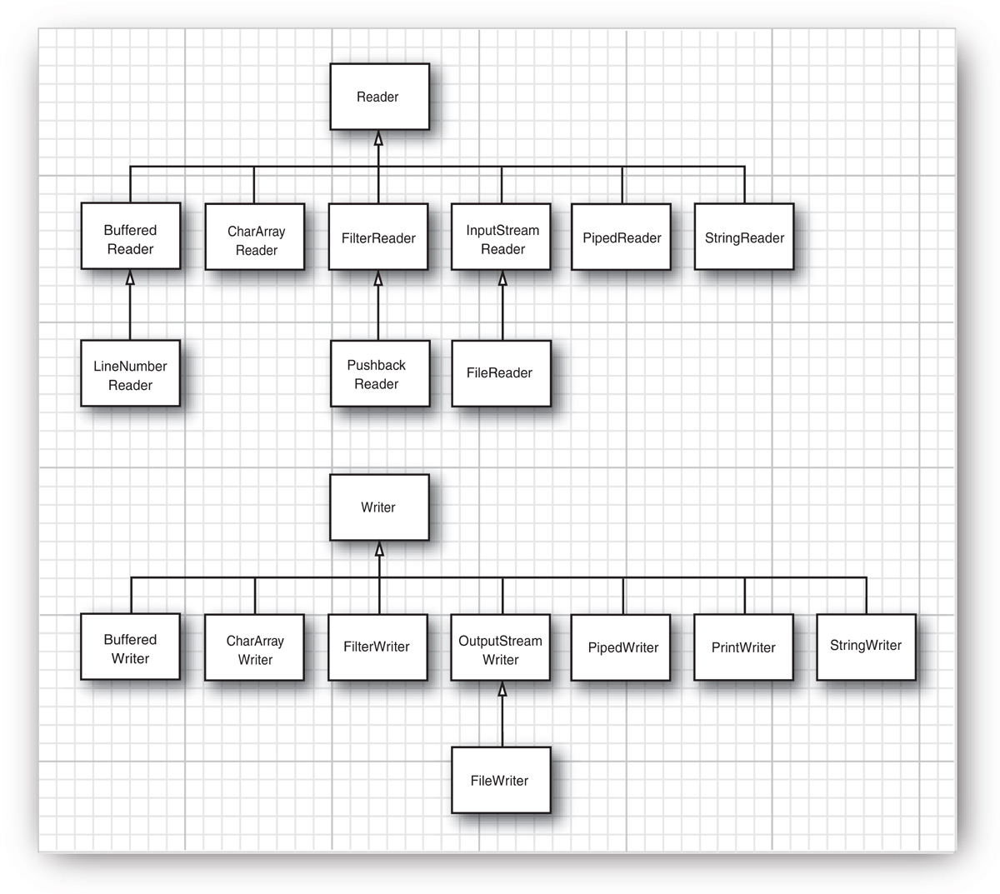
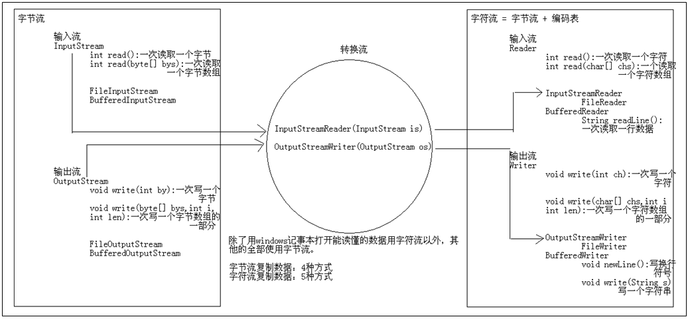

# IO Stream

流(stream)的概念源于UNIX中管道(pipe)的概念。
在UNIX中，管道是一条不间断的字节流，
用来实现程序或进程间的通信，或读写外围设备、外部文件等。

一个流，必有源端和目的端，它们可以是计算机内存的某些区域，
也可以是磁盘文件，甚至可以是Internet上的某个URL。

在Java中将这种通过不同输入输出设备（键盘，内存，显示器，网络等）之间的数据传输抽象为“流”，
程序允许通过流的方式与输入输出设备进行数据传输。

流按流向分为:

- 输入流
- 输出流

流按数据分为:

- 字节流, 数据单元为byte, 抽象基类InputStream和OutputStream
- 字符流, 数据单元为char, 抽象基类Reader和Writer, 
Java中的字符是Unicode编码，一个字符占用两个字节

字符流=字节流+编码表

 Java.io是大多数面向数据流的输入/输出类的主要软件包。
 此外，Java也对块传输提供支持，在核心库 java.nio中采用的便是块IO。

 Java的IO模型使用Decorator模式.

## Data Stream

- DataInputStream/DataOutputStream
- ObjectInputStream/ObjectOutputStream, Object必须实现Serializable接口

## Reference

- [Java基础：IO流之字节流和字符流](http://blog.csdn.net/axi295309066/article/details/52820203)
