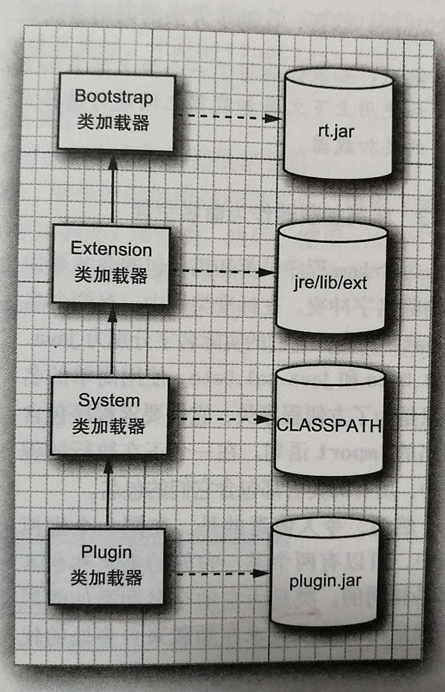

# Java 类加载

.class类文件存储了JVM的指令, JVM能够将JVM指令集转换为目标机器的机器语言.

JVM只加载程序执行时所需要的类文件.

类的解析是指加载某个类所以来的所有类的过程.

JVM加载类的大概流程:

1. 根据加载机制来加载类文件, 可以从本地磁盘, web远程等加载, 把获取到的字节码传递给虚拟机
2. 类的解析
3. 执行main方法
4. 执行过程中加载更多的相关的类

类的加载机制会用到多个类加载器, 每个Java程序至少拥有3个类加载器:

- Bootstrap引导类加载器, 是JVM不可分割的一部分, 用于加载系统类, 
通常从**jre/lib/rt.jar**中进行加载, 这部分加载的系统类没有对应的ClassLoader.
- Extension扩展类加载器, 从**jre/lib/ext**加载扩展类, 并且不会根据classpath进行加载类
- System系统类加载器(又称应用类加载器), 用于加载开发人员实现的应用类, 从**classpath设置的目录或者是jar文件**里加载类

```
// String是系统类, 由Bootstrap加载
String.class.getClassLoader() // null

```

Extension类加载器和System类加载器都是URLClassLoader的**实例**.

类加载器有一种父-子关系, 除了Bootstrap类加载器, 每个类加载器都有一个父级的类加载器.
类加载器在加载一个类的时候, 首先交由父级类加载器来进行加载, 
当父级类加载器没有找到对应的类时, 才由自己进行加载.



每个线程都有一个对类加载器的引用, 它被称为**上下文类加载器**.
主线程的上下文类加载器是System类加载器.

新线程创建时的上下文类加载器为创建该线程的上下文类加载器, 
即如果没有显式去设定, 则所有线程都会使用System类加载器

- 在应用程序代码中, 类是由包和类名来定位
- 在JVM中, 类是由**类的全名(包和类名)和类加载器**来确定的.

通过继承ClassLoader来实现自定义的类加载器.

- ClassLoader用于加载单个类
- URLClassLoader可以加载类, 也可以加载类目录或者JAR文件

