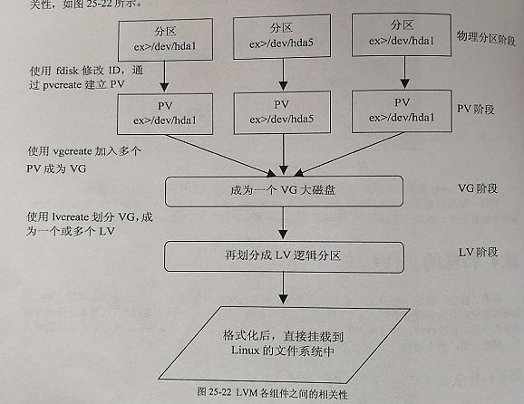

# 创建LVM分区

所有的操作尽量使用root来操作



从物理硬盘创建新分区, 格式化为LVM

```
$ fdisk /dev/sda

# p 列出所有分区信息
Command: p

# n 创建新分区
Commond: n

# t 格式化分区, 选择LVM格式
Command: t

# w 保存分区表

# 立即读取最新的分区表
$ partprobe

```

---

使用新创建的分区来创建物理卷PV(Physical Volume)

```
# 查看当前的PV列表
$ pvscan

# 创建PV卷
$ pvcreate /dev/sda2

# 查看pv详情
$ pvdisplay

```

---

建立卷组VG(Volume Group), 并关联到创建的PV上

```
# 创建VG
$ vgcreate home-vg /dev/sda2

```

---

使用新建立的VG来建立逻辑卷LV(Logical Volume)

```
$ lvcreate -L 100G -n home-lv home-vg
```

格式化LV并挂在到系统中

```
# 格式化ext4
$ mke2fs -t ext4 /dev/home-vg/home-lv
$ mount -t ext4 /mnt/home /dev/home-vg/home-lv
```

启动时自动挂载在/etc/fstab文件进行设置, 加入下面的命令即可

```
# /home was on /dev/sda2
/dev/mapper/home--vg-home--lv /home     ext4    defaults        0       2
```

