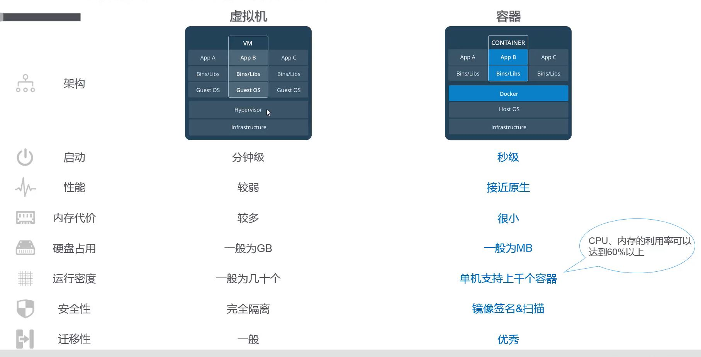
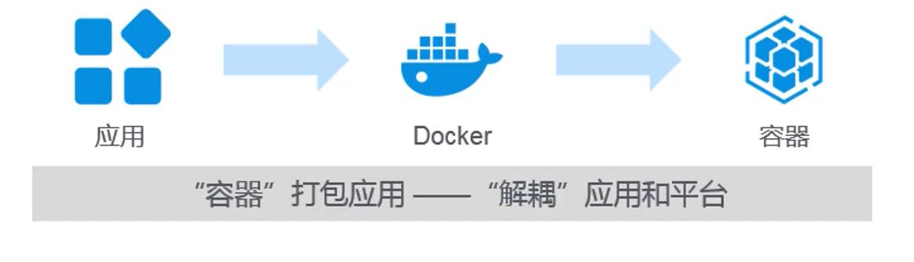
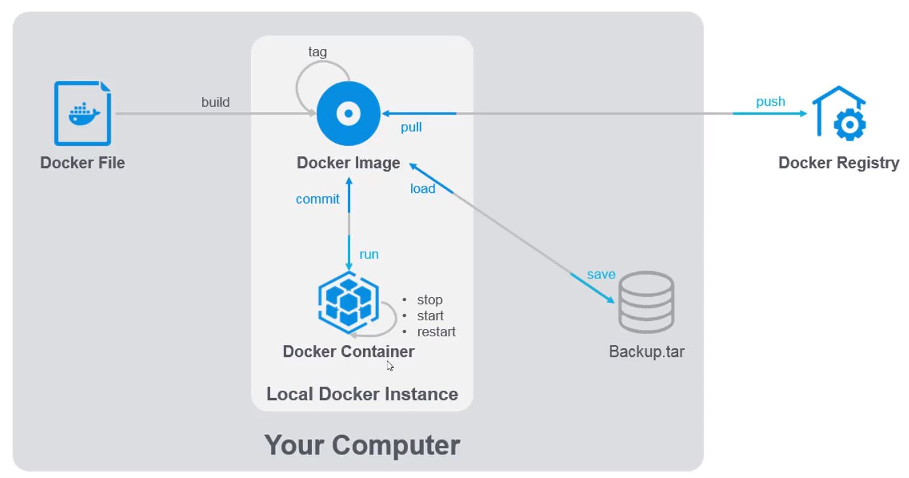
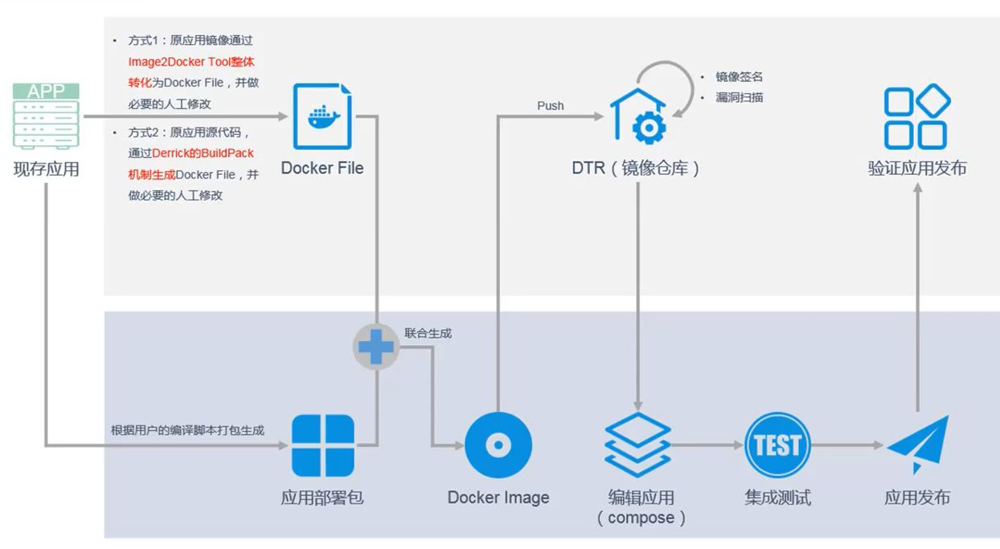

# Docker 基本介绍

基于Docker可以做到**应用组件**一次构建到处运行.

Docker通过**命名空间隔离**的技术将宿主机的资源分配给docker, 然后docker实例以应用进程的形式执行.

## 核心元素

- Docker File
- Docker Registry
- Docker Image
- Docker Container

## 核心技术

- Namespace
- Control Group
- UFS(Union File System)
- Network Virtualization

### Namespace

- 进程(pid)命名空间
    - 同一进程在不同的命名空间, 它的进程号不相同
    - 进程空间是一个父子关系的结构, 子空间的进程对于父空间可见
    - 新fork出的进程在父进程命名空间和子进程命名空间, 分别有一个进程号对应
- 网络(net)命名空间
    - 为进程提供完全独立的网络协议栈视图, 包括: 网络设备接口, IPv4, IPv6, IP路由表, 防火墙规则, sockets等, 来隔离每个容器的网络
    - 采用虚拟网络设备(Virtual Network Device)的方式, 将不同命名空间的网络设备连接在一起
- 进程间通信(IPC)命名空间
    - 同一个IPC命名空间的进程彼此可见, 允许交互
- 挂载(mnt)命名空间
    - 类似chroot, 将进程放到一个特性的目录执行
    - 挂载命名空间允许不同命名空间的进程看到的文件结构不同, 每个命名空间中的进程所看到的文件目录彼此隔离
- UTS(Unix Time-Sharing System)命名空间
    - 允许每个容器拥有独立的主机名和域名
    - 可以虚拟出一个独立主机名和网络空间的环境, 类似网络上一台独立的主机
- 用户命名空间

### UFS

采用AUFS, 每层都有唯一的ID

启动容器时, 将在镜像文件系统的最顶层挂载一个最新的可读写的层给容器.

当数据对象较大时, 意味着IO性能较差, 一般推荐将数据对象制作为数据卷, 通过volume方式挂载, 而不是直接修改镜像内的数据.

### 网络虚拟化

单主机容器通信:

- Bridge
- Host
- None
- Other Container

跨主机容器通信:

- 隧道方案
    - Overlay
    - Weave
    - Flannel
- 路由方案
    - Calico
    - MacVLAN

## 数据管理

- 数据卷, 映射主机目录到容器中
- 数据卷容器, 多容器间共享一些持续更新的数据

## Docker 开源工具

docker三剑客:

- docker machine
- docker compose
- docker swarm

## 应用场景

- 传统应用容器化
- 创新应用微服务化
- 开发运维一体化DevOps

### 传统应用容器化

