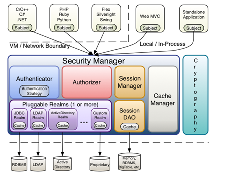

# Shiro

大概的处理流程:

- Shiro Filter
- 获取token
- 使用token来进行Subject.login
- 通过Realm.supports来找到对应的Realm
- 将token传递给Realm.doGetAuthenticationInfo, 进行认证, 获取认证后的信息
- 将获取到的认证后的信息传递给Realm.doGetAuthorizationInfo, 进行鉴权, 获取角色和权限信息

## Shiro的拦截器Filter

配置在**ShiroFilterFactoryBean**中

## Reference

- [跟我学Shiro](http://jinnianshilongnian.iteye.com/blog/2049092)