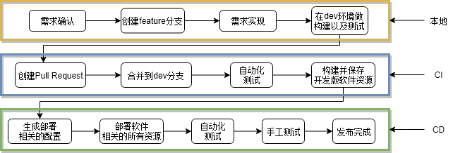

# CI/CD自动化流水线概述

自动化流水线最主要的几个步骤:

- 需求跟踪, 跟踪需求进度以及生成发布版本相关的需求变更信息
- 构建, 生成**可用的**软件资源
- 自动化测试, 保证构建的软件资源的可用性以及质量, 尽可能早的发现问题
- 部署, 将所有相关的软件资源部署到相关的环境, 并且能够正确执行

通过**自动化集成工具**将各个环节连接起来, 例如: jenkins, travis等

软件资源主要指以下几个方面:

- 软件代码
- 软件配置
- 环境, 包括运行的操作系统, 基础设施, 依赖服务等以及环境相关的配置
- 软件数据, 包括数据的结构和数据集

通过使用**版本管理**, 尽可能对软件相关的所有资源进行版本化管理, 便于跟踪和回滚.

## 需求跟踪

目前业内大多推崇**敏捷开发模式**, 一般会使用scrum和kanban.

- milestone, 来跟踪每个发布版本中的需求变更信息
- backlog, 来跟踪每个需求任务的内容以及进度
- 软件资源的版本管理, 来跟踪针对每个backlog需求的修改, 目前业内比较流行使用**git**

将backlog和milestone关联, 能够在每次发布时生成该milestone阶段中涉及的所有需求变更.

将backlog和各种软件资源的修改记录关联, 能够知道每个需求的实现涉及到哪些软件资源的修改.

## 构建

- 静态代码检查
- 构建资源管理, 可以使用[sonatype nexus][]
- 构建资源的版本管理, 详见[Software versioning Wiki][]

## 自动化测试

- 单元测试
- 

---

[Software versioning Wiki]: https://en.wikipedia.org/wiki/Software_versioning
[A successful Git branching model]: https://nvie.com/posts/a-successful-git-branching-model/
[Testing Strategies in a Microservice Architecture]: https://martinfowler.com/articles/microservice-testing/
[sonatype nexus]: https://help.sonatype.com/repomanager3