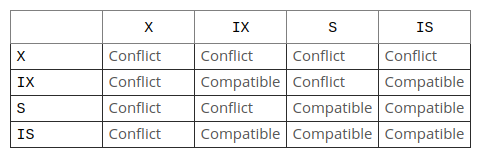

# 锁机制

环境: mysql 5.7
Engine: InnoDB
隔离级别: REPEATABLE READ

```mysql
# 开启innodb标准监控
SET GLOBAL innodb_status_output=ON;
# 开启innodb锁监控
SET GLOBAL innodb_status_output_locks=ON;
# 设置锁的超时时间
set global innodb_lock_wait_timeout=3600;

# 查看锁日志
show engine innodb status \G;
```

准备测试用数据
```mysql
CREATE DATABASE `test_innodb_lock` DEFAULT CHARACTER SET utf8mb4 ;

CREATE TABLE `test` (
  `id` INT UNSIGNED NOT NULL AUTO_INCREMENT,
  `uid` INT UNSIGNED NOT NULL,
  `status` INT UNSIGNED NOT NULL DEFAULT 0,
  `create_time` DATETIME NOT NULL DEFAULT now(),
  `update_time` DATETIME NOT NULL DEFAULT now(),
  PRIMARY KEY (`id`),
  UNIQUE INDEX `uid_UNIQUE` (`uid` ASC)
) engine=InnoDB default charset utf8mb4;

```

## 锁的种类

行级的锁:
- 共享锁(S)
- 排他锁(X)

表级的锁:
- 意向锁(Intention Locks)
- 共享锁(S)
- 排他锁(X)
  - 自增锁(AUTO-INC Locks)

表级锁的兼容性组合:



索引级的锁:
- 记录锁(Record Locks)
- 间隙锁(Gap Locks)
- 下一键锁(Next-Key Locks) = 记录锁 + 间隙锁
- 插入意向锁(Insert Intention Locks)

InnoDB的间隙锁是“纯粹的抑制性的”，这意味着它们的唯一目的是**防止其他事务插入间隙**。
**间隙锁可以共存**。一个事务进行的间隙锁定不会阻止另一事务对相同的间隙进行间隙锁定。
共享间隙锁和排他间隙锁之间没有区别。它们彼此不冲突，并且执行相同的功能。

**表级/索引级的锁可以和行级锁进行组合, 表示将要对行执行某种锁策略**.

锁申请的顺序: 表级锁 -> 索引级锁 -> 行级锁,
若要申请的锁和现有锁冲突, 则等待持有现有锁的事务释放该锁, 然后再申请锁.

## 锁日志格式

事务的锁统计日志
``` mysql
---TRANSACTION <transaction id>, ACTIVE 4 sec
<锁种类数量> lock struct(s), heap size 1136, <行级锁的数量> row lock(s)

-- 例子
---TRANSACTION 1877, ACTIVE 4 sec
2 lock struct(s), heap size 1136, 2 row lock(s)
```

---

意向锁日志
``` mysql
TABLE LOCK table <db>.<table> trx id <transaction id> lock mode <Intention Locks + Row Lock>

例子:
TABLE LOCK table `test_innodb_lock`.`test` trx id 1877 lock mode IX

事务1877持有表`test_innodb_lock`.`test`的IX(意向排他锁), 
表示将对表`test_innodb_lock`.`test`中的行申请排他锁
```

---

记录锁日志

``` mysql
RECORD LOCKS space id 26 page no 3 n bits 72 index <索引名> of table <db>.<table> trx id <事务id> lock_mode <行级锁类型> locks rec but not gap
Record lock, heap no 4 PHYSICAL RECORD: n_fields 7; compact format; info bits 0
 0: len 4; hex <索引对应的行的值>; asc     ;;
 ...

例子:

mysql>> select * from test where id in (3, 8) for update;
mysql>> show engine innodb status \G;
...
RECORD LOCKS space id 26 page no 3 n bits 72 index PRIMARY of table `test_innodb_lock`.`test` trx id 1877 lock_mode X locks rec but not gap
Record lock, heap no 4 PHYSICAL RECORD: n_fields 7; compact format; info bits 0
 0: len 4; hex 00000003; asc     ;;
 ...

Record lock, heap no 6 PHYSICAL RECORD: n_fields 7; compact format; info bits 0
 0: len 4; hex 00000008; asc     ;;
 ...
```

---

间隙锁

```mysql

RECORD LOCKS space id 26 page no 4 n bits 72 index <索引名> of table <db>.<table> trx id <事务id> lock_mode <行级锁类型>
Record lock, heap no 1 PHYSICAL RECORD: n_fields 1; compact format; info bits 0
 0: len 8; hex <负无限值-NaN, 73757072656d756d>; asc supremum;;
 
 Record lock, heap no 2 PHYSICAL RECORD: n_fields 7; compact format; info bits 0
 0: len 4; hex <索引对应的行的值>; asc     ;;

每2个形成一个区间

例子:

mysql> select * from test where uid between 4 and 12 for update;
mysql>> show engine innodb status \G;
...
RECORD LOCKS space id 26 page no 3 n bits 72 index PRIMARY of table `test_innodb_lock`.`test` trx id 1891 lock_mode X
Record lock, heap no 1 PHYSICAL RECORD: n_fields 1; compact format; info bits 0
 0: len 8; hex 73757072656d756d; asc supremum;;

Record lock, heap no 2 PHYSICAL RECORD: n_fields 7; compact format; info bits 0
 0: len 4; hex 00000009; asc     ;;
...

Record lock, heap no 3 PHYSICAL RECORD: n_fields 7; compact format; info bits 0
 0: len 4; hex 00000007; asc     ;;
...

```

---

**插入意向锁日志**

```mysql
RECORD LOCKS space id 26 page no 4 n bits 72 index <索引名> of table <db>.<table> trx id <事务id> lock_mode <行级锁类型> locks gap before rec insert intention


例子:

RECORD LOCKS space id 26 page no 4 n bits 72 index uid_UNIQUE of table `test_innodb_lock`.`test` trx id 1879 lock_mode X locks gap before rec insert intention
Record lock, heap no 3 PHYSICAL RECORD: n_fields 2; compact format; info bits 0
 0: len 4; hex 0000000c; asc     ;;
 1: len 4; hex 00000007; asc     ;;
```


## Reference

- [Enabling InnoDB Monitors](https://dev.mysql.com/doc/refman/5.7/en/innodb-enabling-monitors.html)
- [InnoDB Standard Monitor and Lock Monitor Output](https://dev.mysql.com/doc/refman/5.7/en/innodb-standard-monitor.html)
- [InnoDB Transaction Activity Metrics](https://dev.mysql.com/doc/mysql-em-plugin/en/myoem-metric-innodb-transactionactivity-category.html)