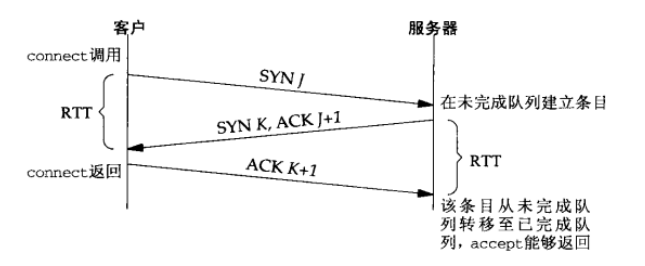
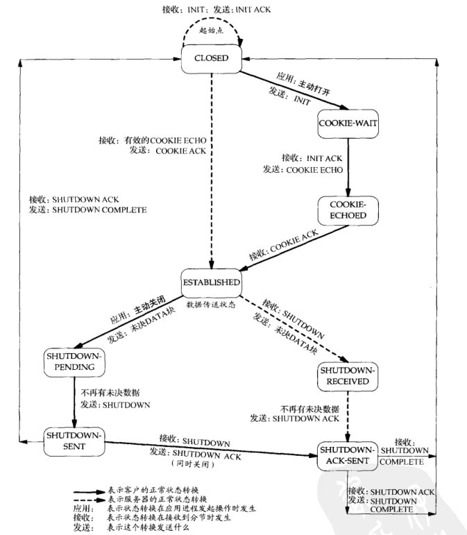

# TCP Socket编程

创建socket需要以下几部分, 成功后会返回一个socket描述符(sockfd)

- AF_XXX, 协议簇
- SOCK_XXX, 协议类型
- IPPROTO_XXX, 根据AF_XXX和SOCK_XXX得到的指定常量值, 可设为0, 让系统去判断.

套接字的类型

- 主动套接字, passive socket, 刚创建的socket, 将被转换为以下几种套接字
- 监听套接字, listen socket, 属于被动套接字, 用于监听是否有新的连接
- 连接套接字, connected socket, 用于和对应的socket进行通信

bind用来将本地协议地址和指定的套接字进行绑定, 若IP地址或端口为0, 则由内核来决定.

协议地址 = ip + port

如果连接套接字不调用bind, 则会由内核来根据所用的外出网络接口来确定**源IP地址**, 
并选择一个临时端口作为**源端口**.

如果监听套接字不调用bind, 则会由内核把客户发送的目的IP作为**源IP地址**, 
并选择一个临时端口作为**源端口**.

通过getsockname来获取本地协议地址, 包括IP和端口.

## 监听套接字, listen socket

刚创建的socket是一个主动套接字, 使用**listen**函数将其转换为被动的监听套接字.

内核为监听套接字维护两个队列:

- 未完成连接队列, 等待完成TCP三次握手的套接字队列, 套接字处于SYN_RCVD状态
- 已完成连接队列, 已完成TCP三次握手的套接字队列, 套接字处于ESTABLISHED状态

listen backlog >= 未完成连接队列 + 已完成连接队列

**accept**函数从**已完成连接队列**头返回下一个已完成连接的socket,
如果队列空了, 进程挂起(socket为默认的阻塞方式).

## Summary

TCP socket状态变化

---

