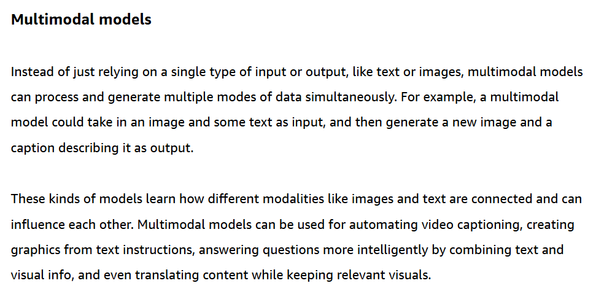
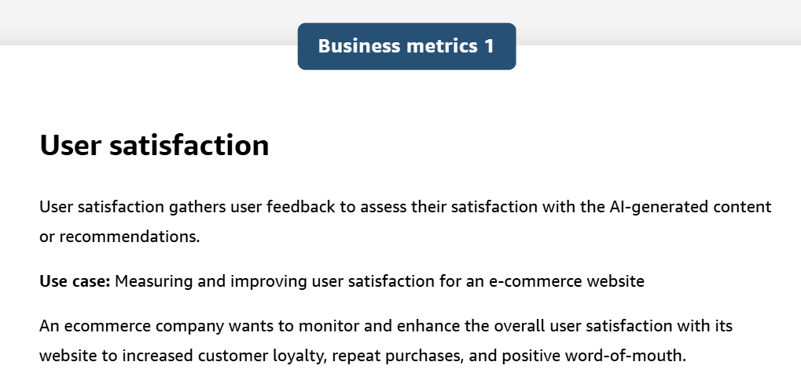

# Introduction

## Machine Learning

Building a machine learning model involves data collection and preparation, selecting an appropriate algorithm, training the model on the prepared data, and evaluating its performance through testing and iteration.

### Training Data

- labeled data
- unlabeled data

The main types of data used in training are structured and unstructured data. 

### Process

The ML learning process is traditionally divided into three broad categories:

### Inferencing

### ML use Tech and Use cases

#### supervised ML

#### unsupervised ML

## Deep Learning

### Neural networks

deep learning is used to enhance results:

## Generative AI

### Foundation models(FMs)

#### FM life

- self-supervised learning

#### FM Types

- token
- embeddings and vectors

- Forward diffusion
- Reverse diffusion

Other generative models:

### Business metrics

