# Responsible AI

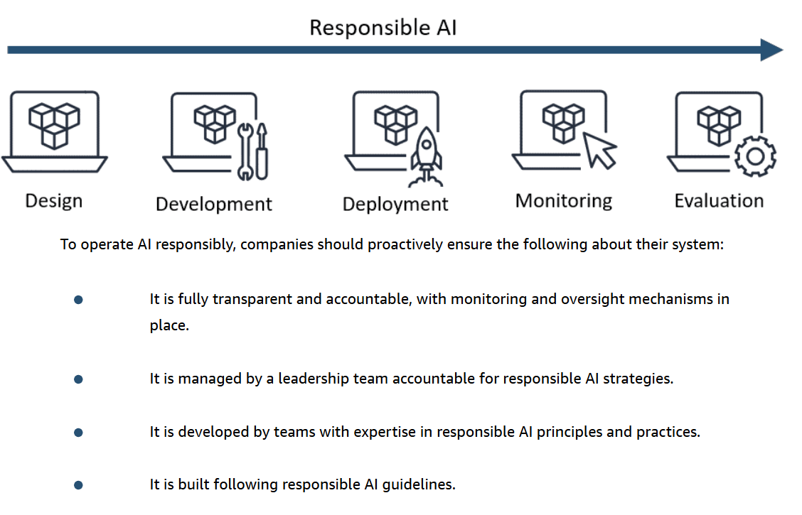

## overcome bias and variance errors

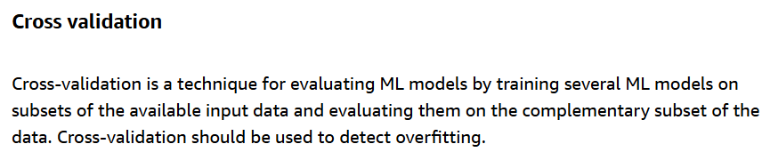

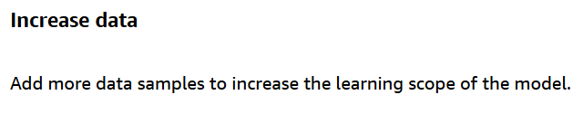

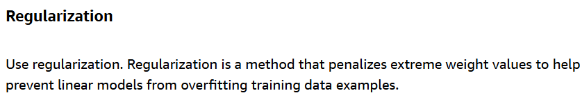

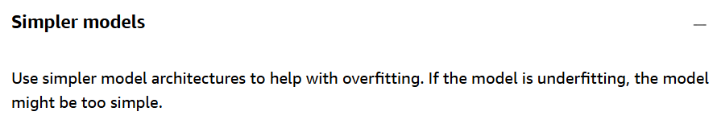

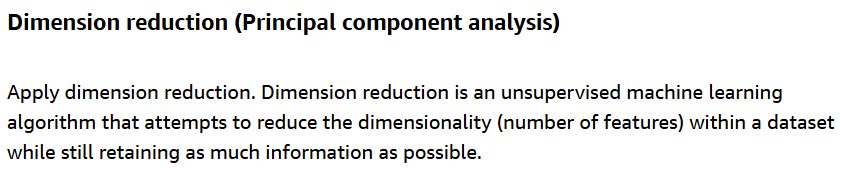

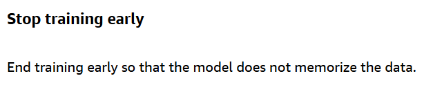

## Challenges of generative AI

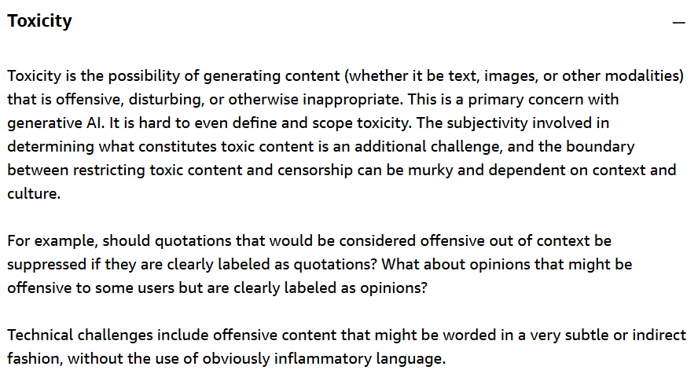

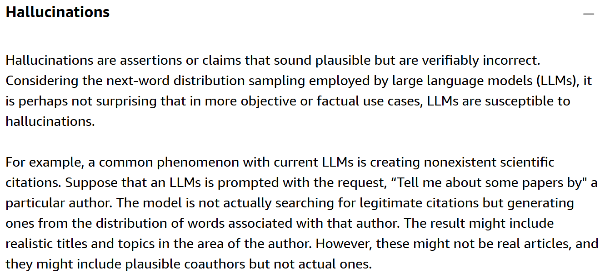

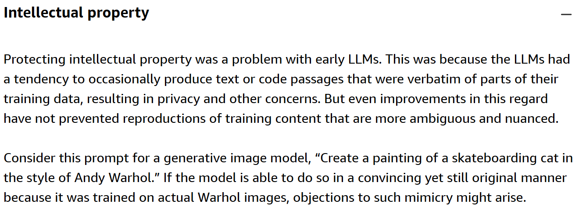

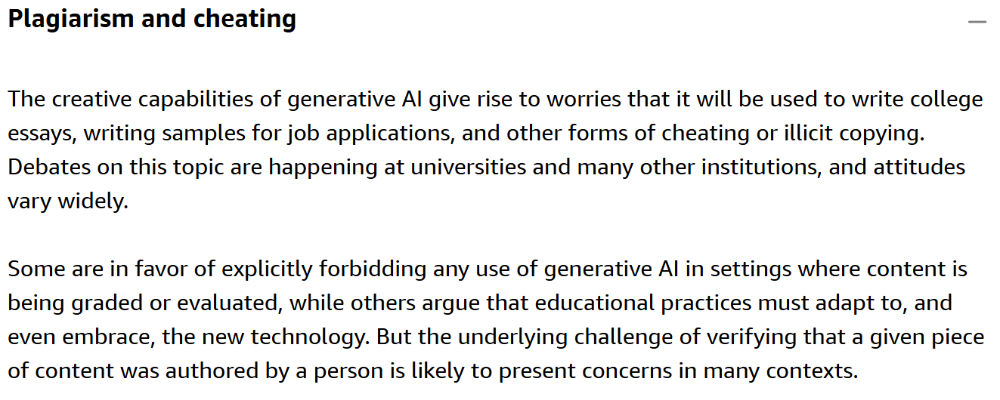

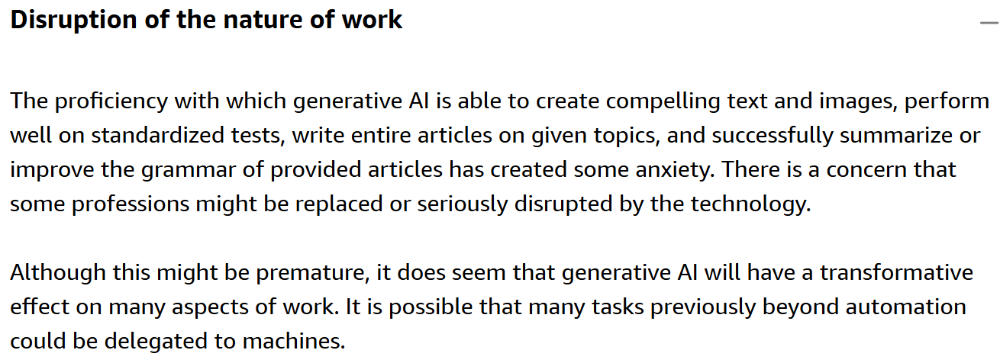

## Core dimensions

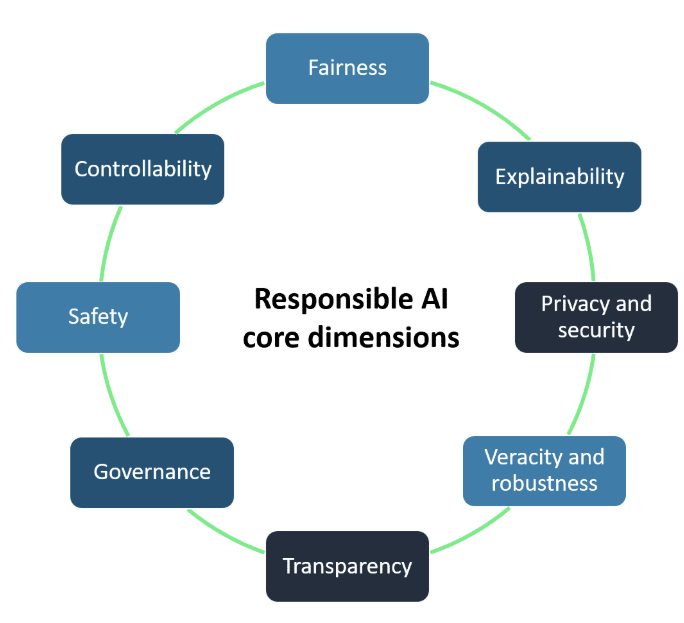

## Data preparation

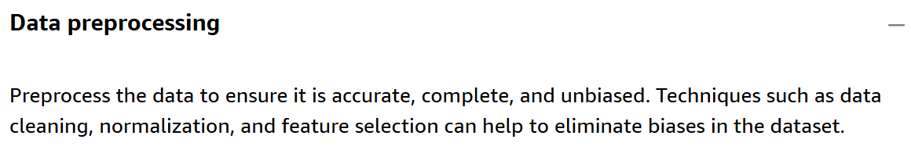

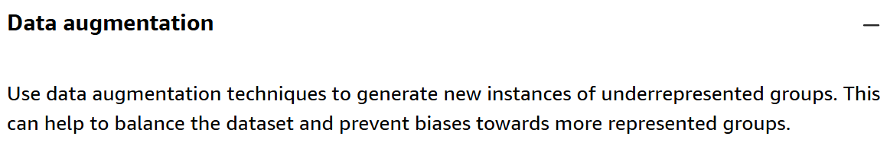

## Solutions for transparent and explainable models

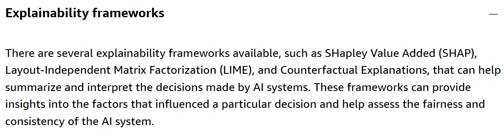

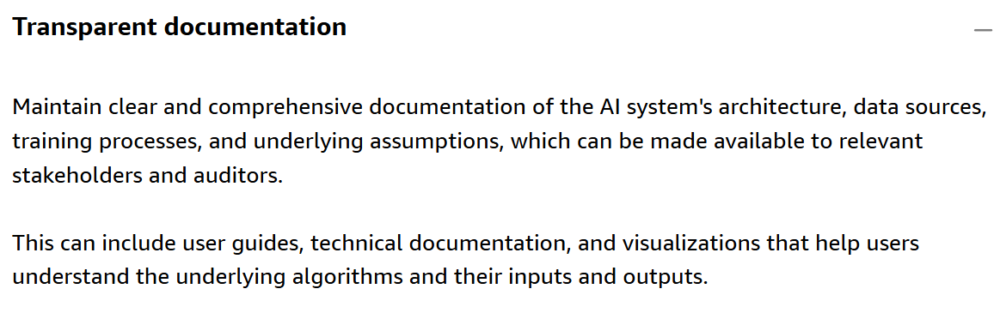

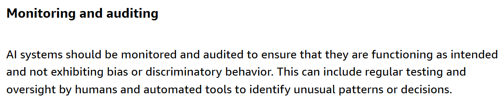

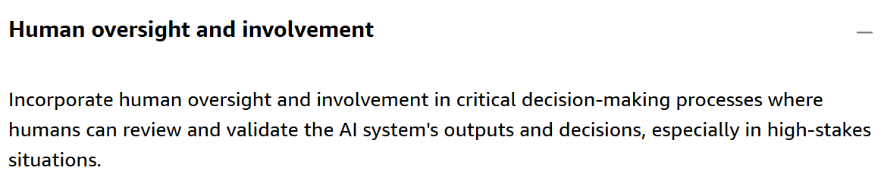

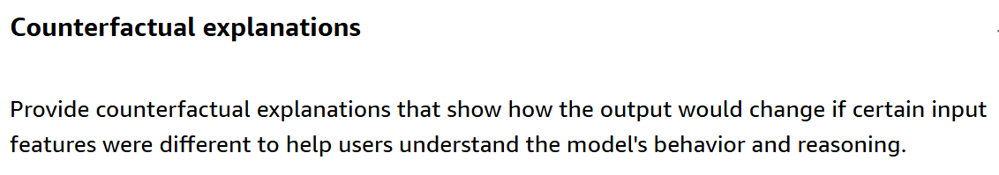

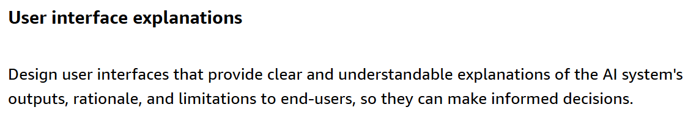