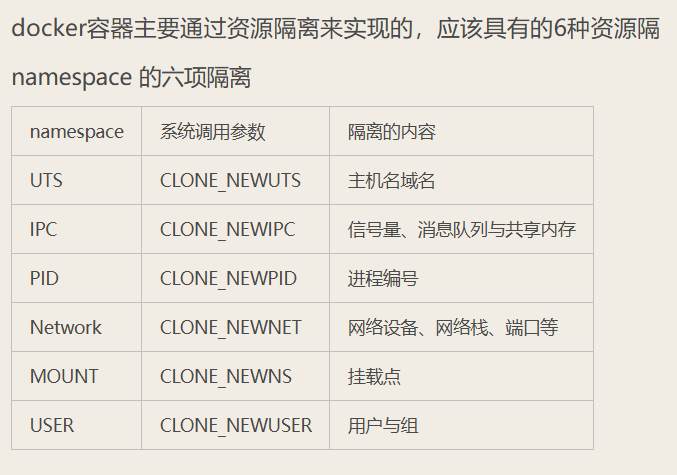
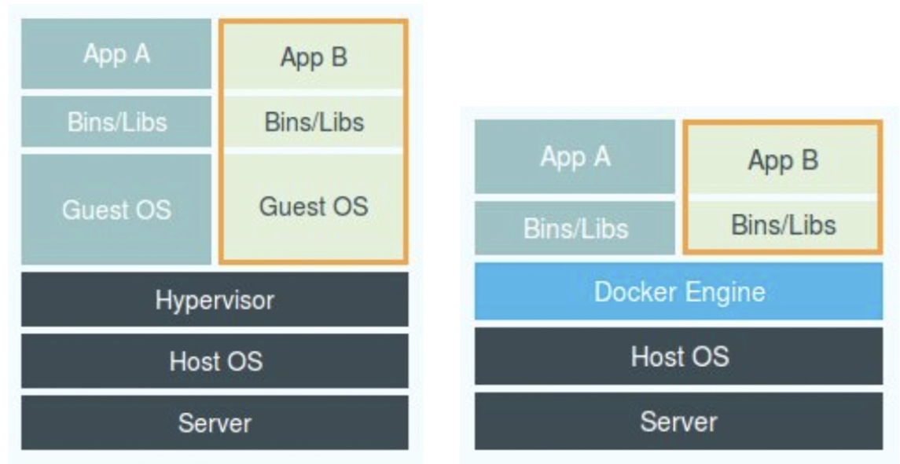
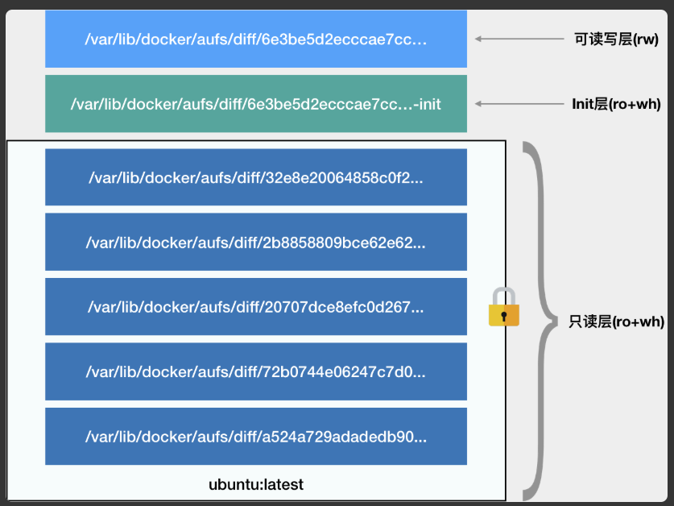
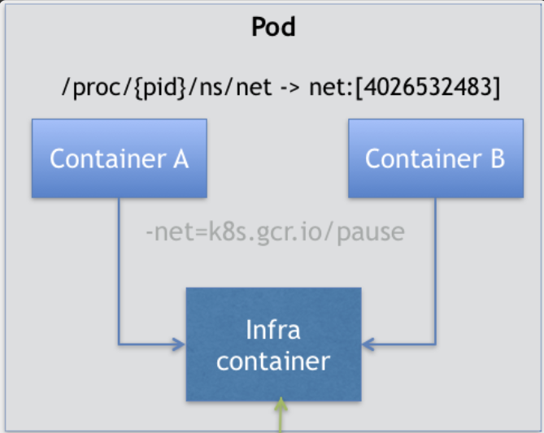

# k8s 快速入门

```bash
# 常用命令, 一般都需要指定 kind 和 namespace
# kind: pod/svc/deployment/pv/pvc
# 集群切换, k3d 的集群需要加上前缀 k3d-<cluster-name>
$ kubectl config use-context <cluster-name>
# 启动一次性的Pod，用完即删
$ kubectl run -i --tty --image busybox:1.28.4 <pod-name> --restart=Never --rm /bin/bash 
# 查看状态
$ kubectl get <kind>
# 查看详情
$ kubectl describe
# 应用配置
$ kubectl apply -f <file.yml>
# 修改配置
$ kubectl edit
$ kubectl set image
# 查看日志
$ kubectl logs
# 进入 container
$ kubectl exec -it <pod-name> -c <container-name> -- /bin/sh
# 查看 Deployment 的发布历史
$ kubectl rollout history deployment/<deployment-name> -n <namespace>
# 回滚到指定版本
$ kubectl rollout undo deployment/<deployment-name> --to-revision=<revision-number> -n <namespace>
# 回滚到上一个版本
$ kubectl rollout undo deployment/<deployment-name> -n <namespace>
# 强制重启
$ kubectl rollout restart deployment/<name> -n <namespace>
# 删除
$ kubectl delete <kind> <kind-name>
# 端口转发
$ kubectl port-forward -n <namespace> pod/<pod-name> <host-port>:<pod-port> 
$ kubectl port-forward -n <ns> svc/<svc-name> [<host-port>:<pod-port>, ...]
```

## 容器基础

容器技术的核心功能，就是通过约束和修改进程的动态表现，从而为其创造出一个“边界”。

容器是一个“单进程”模型。

对于 Docker 等大多数 Linux 容器来说，Cgroups 技术是用来制造约束，限制资源的主要手段，而 Namespace 技术则是用来修改进程视图，对资源进行隔离的主要方法。

### Cgroups 对资源进行限制

Linux Cgroups 的全称是 Linux Control Group。它最主要的作用，就是限制一个进程组能够使用的资源上限，包括 CPU、内存、磁盘、网络带宽等等。

### Namespace 对资源进行隔离

Linux 里面的 Namespace 机制: 对被隔离应用的进程空间做了手脚，使得这些进程只能看到重新计算过的进程编号.



在创建容器进程时，指定了这个进程所需要启用的一组 Namespace 参数。这样，容器就只能“看”到当前 Namespace 所限定的资源、文件、设备、状态，或者配置。而对于宿主机以及其他不相关的程序，它就完全看不到了。所以说，容器，其实是一种特殊的进程而已。



既然容器只是运行在宿主机上的一种特殊的进程，那么多个容器之间使用的就还是同一个宿主机的操作系统内核。

Mount Namespace 跟其他 Namespace 的使用略有不同的地方：它对容器进程视图的改变，一定是伴随着挂载操作（mount）才能生效。

实际上，Mount Namespace 正是基于对 `chroot` 的不断改良才被发明出来的，它也是 Linux 操作系统里的第一个 Namespace。

### rootfs for container

我们一般会在这个容器的根目录下挂载一个完整操作系统的文件系统，比如 Ubuntu16.04 的 ISO。这样，在容器启动之后，我们在容器里通过执行 "ls /" 查看根目录下的内容，就是 Ubuntu 16.04 的所有目录和文件。而这个挂载在容器根目录上、用来为容器进程提供隔离后执行环境的文件系统，就是所谓的“容器镜像”。它还有一个更为专业的名字，叫作：rootfs（根文件系统）。

rootfs 只是一个操作系统所包含的文件、配置和目录，并不包括操作系统内核。在 Linux 操作系统中，这两部分是分开存放的，操作系统只有在开机启动时才会加载指定版本的内核镜像。

同一台机器上的所有容器，都共享宿主机操作系统的内核。

由于 rootfs 里打包的不只是应用，而是整个操作系统的文件和目录，也就意味着，应用以及它运行所需要的所有依赖，都被封装在了一起。这种深入到操作系统级别的运行环境一致性，打通了应用在本地开发和远端执行环境之间难以逾越的鸿沟。

对 Docker 项目来说，它最核心的原理实际上就是为待创建的用户进程：

1. 启用 Linux Namespace 配置；
2. 设置指定的 Cgroups 参数；
3. 加载rootfs，切换进程的根目录（Change Root）到对应的目录。

Union File System 也叫 UnionFS，最主要的功能是将多个不同位置的目录联合挂载（union mount）到同一个目录下。



为了实现这样的删除操作，AuFS 会在可读写层创建一个 whiteout 文件，把只读层里的文件“遮挡”起来。

使用 docker commit 和 push 指令，保存这个被修改过的可读写层.

Init 层是 Docker 项目单独生成的一个内部层，专门用来存放 /etc/hosts、/etc/resolv.conf 等信息。只对当前的容器有效，执行 docker commit 不会包含这层的内容。

## 容器编排

容器，就是未来云计算系统中的进程；Kubernetes 就是操作系统！

Pod 扮演的是传统部署环境里“虚拟机”的角色，里面运行多个容器。

### Pod

Pod，是 Kubernetes 项目中最小的 API 对象，是 Kubernetes 项目的原子调度单位。

在一个真正的操作系统里，进程并不是“孤苦伶仃”地独自运行的，而是以进程组的方式，“有原则地”组织在一起。

Pod，其实是一组共享了某些资源的容器。在 Kubernetes 项目里，Pod 的实现需要使用一个中间容器，这个容器叫作 Infra 容器。在这个 Pod 中，Infra 容器永远都是第一个被创建的容器，而其他用户定义的容器，则通过 Join Network Namespace 的方式，与 Infra 容器关联在一起。



在 Kubernetes 项目里，Infra 容器一定要占用极少的资源，所以它使用的是一个非常特殊的镜像，叫作：k8s.gcr.io/pause。这个镜像是一个用汇编语言编写的、永远处于“暂停”状态的容器。

Infra 容器镜像的 rootfs 里几乎什么都没有，没有你随意发挥的空间。当然，这同时也意味着你的网络插件完全不必关心用户容器的启动与否，而只需要关注如何配置 Pod，也就是 Infra 容器的 Network Namespace 即可。

**容器设计模式**：Pod 这种“超亲密关系”容器的设计思想，实际上就是希望，当用户想在一个容器里跑多个功能并不相关的应用时，应该优先考虑它们是不是更应该被描述成一个 Pod 里的多个容器。

在 Pod 中，所有 Init Container 定义的容器，都会比 spec.containers 定义的用户容器先启动。并且，Init Container 容器会按顺序逐一启动，而直到它们都启动并且退出了，用户容器才会启动。

实际上，这个所谓的“组合”操作，正是容器设计模式里最常用的一种模式，它的名字叫：sidecar。

凡是调度、网络、存储，以及安全相关的属性，基本上是 Pod 级别的。

#### 容器健康检查（livenessProbe）

在 Kubernetes 中，你可以为 Pod 里的容器定义一个健康检查“探针”（Probe）。这样，kubelet 就会根据这个 Probe 的返回值决定这个容器的状态，而不是直接以容器镜像是否运行（来自 Docker 返回的信息）作为依据。这种机制，是生产环境中保证应用健康存活的重要手段。

#### 容器恢复机制（restartPolicy）

restartPolicy 是 Pod 的 Spec 部分的一个标准字段（pod.spec.restartPolicy），默认值是 Always，即：任何时候这个容器发生了异常，它一定会被重新创建。

Pod 的恢复过程，永远都是发生在当前节点上，而不会跑到别的节点上去。事实上，一旦一个 Pod 与一个节点（Node）绑定，除非这个绑定发生了变化（pod.spec.node 字段被修改），否则它永远都不会离开这个节点。这也就意味着，如果这个宿主机宕机了，这个 Pod 也不会主动迁移到其他节点上去。

如果你想让 Pod 出现在其他的可用节点上，就必须使用 Deployment 这样的“控制器”来管理 Pod。

对于包含多个容器的 Pod，只有它里面所有的容器都进入异常状态后，Pod 才会进入 Failed 状态。在此之前，Pod 都是 Running 状态。此时，Pod 的 READY 字段会显示正常容器的个数。

### PodPreset

运维人员就可以定义一个 PodPreset 对象。在这个对象中，凡是他想在开发人员编写的 Pod 里追加的字段，都可以预先定义好。

这时在Pod 运行起来之后，这个 Pod 里多了很多新添加的定义，它们的配置跟 PodPreset 的内容一样。此外，这个 Pod 还被自动加上了一个 annotation 表示这个 Pod 对象被 PodPreset 改动过。

PodPreset 里定义的内容，只会在 Pod API 对象被创建之前追加在这个对象本身上，而不会影响任何 Pod 的控制器的定义，被修改的只是这个 Deployment 创建出来的所有 Pod。

Kubernetes 项目会帮你合并（Merge）这两个 PodPreset 要做的修改。而如果它们要做的修改有冲突的话，这些冲突字段就不会被修改。

### Controller

kube-controller-manager 的组件是一系列控制器的集合，在 Kubernetes 项目的 pkg/controller 目录下列出了所有的控制器。

控制循环（control loop）编排模式，伪代码如下：

```text
for {
  实际状态 := 获取集群中对象X的实际状态（Actual State）
  期望状态 := 获取集群中对象X的期望状态（Desired State）
  if 实际状态 == 期望状态{
    什么都不做
  } else {
    执行编排动作，将实际状态调整为期望状态
  }
}
```

#### Deployment

Deployment 就需要遵循一种叫作“滚动更新”（rolling update）的方式，来升级现有的容器。
这个能力的实现，依赖的是 Kubernetes 项目中的一个非常重要的概念（API 对象）：ReplicaSet。

一个 ReplicaSet 对象，其实就是由副本数目的定义和一个 Pod 模板组成的。它的定义其实是 Deployment 的一个子集。更重要的是，Deployment 控制器实际操纵的，正是这样的 ReplicaSet 对象，而不是 Pod 对象。

应用版本和 ReplicaSet 一一对应.

Deployment 控制 ReplicaSet（版本），ReplicaSet 控制 Pod（副本数）。这个两层控制关系一定要牢记。

### Service

Service 是 Kubernetes 项目中用来将一组 Pod 暴露给外界访问的一种机制。

- 第一种方式，是以 Service 的 VIP（Virtual IP，即：虚拟 IP）方式。
- 第二种方式，就是以 Service 的 DNS 方式。
  - Normal Service。这种情况下，你访问“my-svc.my-namespace.svc.cluster.local”解析到的，正是 my-svc 这个 Service 的 VIP，后面的流程就跟 VIP 方式一致了。
  - Headless Service。这种情况下，你访问“my-svc.my-namespace.svc.cluster.local”解析到的，直接就是 my-svc 代理的某一个 Pod 的 IP 地址。可以看到，这里的区别在于，Headless Service 不需要分配一个 VIP，而是可以直接以 DNS 记录的方式解析出被代理 Pod 的 IP 地址。

#### Headless Service

它是一个标准 Service 的 YAML 文件。只不过，它的 **clusterIP 字段的值是：None**，即：这个 Service，没有一个 VIP 作为“头”。这也就是 Headless 的含义。所以，这个 Service 被创建后并不会被分配一个 VIP，而是会以 DNS 记录的方式暴露出它所代理的 Pod。

它所代理的所有 Pod 的 IP 地址，都会被绑定一个这样格式的 DNS 记录

#### StatefulSet

StatefulSet 的核心功能，就是通过某种方式记录这些状态，然后在 Pod 被重新创建时，能够为新 Pod 恢复这些状态。

- 拓扑状态。这种情况意味着，应用的多个实例之间不是完全对等的关系。这些应用实例，必须按照某些顺序启动
- 存储状态。这种情况意味着，应用的多个实例分别绑定了不同的存储数据。

通过 Headless Service 的方式，StatefulSet 给它所管理的所有 Pod 的名字，进行了编号，编号规则是：`<statefulset name>-<index>`。这些编号都是从 0 开始累加，与 StatefulSet 的每个 Pod 实例一一对应，绝不重复. 这些 Pod 的创建，也是严格按照编号顺序进行的。

StatefulSet 就保证了 Pod 网络标识的稳定性。

对于“有状态应用”实例的访问，你必须使用 DNS 记录或者 hostname 的方式，而绝不应该直接访问这些 Pod 的 IP 地址。

首先，StatefulSet 的控制器直接管理的是 Pod，区分这些实例的方式，就是通过在 Pod 的名字里加上事先约定好的**编号**。其次，Kubernetes 通过 **Headless Service**，为这些有编号的 Pod，在 DNS 服务器中生成带有同样编号的 DNS 记录。只要 StatefulSet 能够保证这些 Pod 名字里的编号不变，那么 Service 里类似于 web-0.nginx.default.svc.cluster.local 这样的 DNS 记录也就不会变，最后，StatefulSet 还为每一个 Pod 分配并创建一个同样编号的 **PVC**。这样，Kubernetes 就可以通过 Persistent Volume 机制为这个 PVC 绑定上对应的 PV，从而保证了每一个 Pod 都拥有一个独立的 Volume。在这种情况下，即使 Pod 被删除，它所对应的 PVC 和 PV 依然会保留下来。所以当这个 Pod 被重新创建出来之后，Kubernetes 会为它找到同样编号的 PVC，挂载这个 PVC 对应的 Volume，从而获取到以前保存在 Volume 里的数据。

### Node Group

Node Group​​（节点组）是一组具有相同配置的节点集合，通常用于批量管理节点的生命周期、资源调度和扩缩容策略。

Node Group 和 Pod 的相互影响：

- taint，阻止在 toleration 中声明指定 taint 的 Pod 调度到该节点
- label，允许在 affinity 中声明了相同 Label 的 Pod 调度到该节点

Pod 选择 node 的方式：

- nodeSelector
- 

## 容器持久化存储

Kubernetes 中 PVC 和 PV 的设计，实际上类似于“接口”和“实现”的思想。开发者只要知道并会使用“接口”，即：PVC；而运维人员则负责给“接口”绑定具体的实现，即：PV。

### Projected Volume

Secret、ConfigMap，以及 Downward API 这三种 Projected Volume 定义的信息，大多还可以通过环境变量的方式出现在容器里。但是，通过环境变量获取这些信息的方式，不具备自动更新的能力。所以，一般情况下，我都建议你使用 Volume 文件的方式获取这些信息。

#### Secret

Secret 对象要求这些数据必须是经过 Base64 转码的，以免出现明文密码的安全隐患。在真正的生产环境中，你需要在 Kubernetes 中开启 Secret 的加密插件，增强数据的安全性。

通过挂载方式进入到容器里的 Secret，一旦其对应的 Etcd 里的数据被更新，这些 Volume 里的文件内容，同样也会被更新。其实，这是 kubelet 组件在定时维护这些 Volume。

#### ConfigMap

ConfigMap 保存的是不需要加密的、应用所需的配置信息。

#### Downward API

让 Pod 里的容器能够直接获取到这个 Pod API 对象本身的信息。

Downward API 能够获取到的信息，一定是 Pod 里的容器进程启动之前就能够确定下来的信息。而如果你想要获取 Pod 容器运行后才会出现的信息，比如，容器进程的 PID，那就肯定不能使用 Downward API 了，而应该考虑在 Pod 里定义一个 sidecar 容器。

#### ServiceAccountToken

Service Account 对象的作用，就是 Kubernetes 系统内置的一种“服务账户”，它是 Kubernetes 进行权限分配的对象。

Service Account 的授权信息和文件，实际上保存在它所绑定的一个特殊的 Secret 对象里的。这个特殊的 Secret 对象，就叫作 ServiceAccountToken。

一旦 Pod 创建完成，容器里的应用就可以直接从这个默认 ServiceAccountToken 的挂载目录里访问到授权信息和文件。这个容器内的路径在 Kubernetes 里是固定的，即：/var/run/secrets/kubernetes.io/serviceaccount

### Persistent Volume Claim

### StorageClass


## Reference

- [深入剖析Kubernetes](https://time.geekbang.org/column/intro/100015201?tab=catalog)
