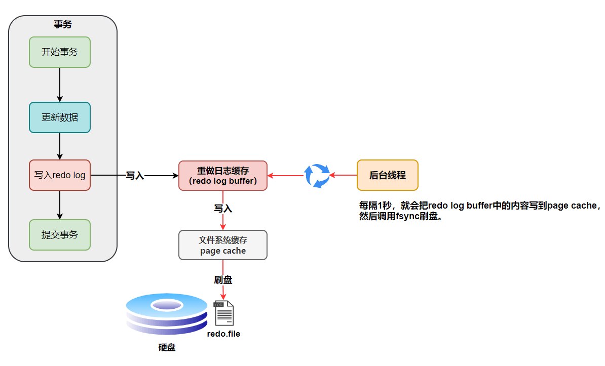

---
tags:
  - db
---

# MySQL with InnoDB

## SQL 执行过程

1. 连接器
2. 分析器，词法，语法分析
3. 优化器，生成执行计划，可通过 `EXPLAIN` 来查看。 
4. 执行器，执行执行计划，从存储引擎返回数据
5. 引擎

## 事务性数据库的四大特性 ACID

- **原子性**（`Atomicity`），事务是最小的执行单位，不允许分割。事务的原子性确保动作要么全部完成，要么完全不起作用。
- **一致性**（`Consistency`），执行事务前后，数据保持一致。
- **隔离性**（`Isolation`），并发访问数据库时，一个用户的事务不被其他事务所干扰，各并发事务之间数据库是独立的。
- **持久性**（`Durability`），一个事务被提交之后。它对数据库中数据的改变是持久的，即使数据库发生故障也不应该对其有任何影响。

**只有保证了事务的持久性、原子性、隔离性之后，一致性才能得到保障。也就是说 A、I、D 是手段，C 是目的！**

## ID 的选择

id列的数据类型尽量选择**递增型整数**。

因为随机值会分布在很大的空间中, 导致insert和select变慢. 而且随机值的插入会随机写到索引的不同位置, 导致insert语句变慢; 由于数据分布在很大的空间中, 也就导致了select指定的数据会变慢; 还会导致缓存失效.

**由于InnoDB的索引是一个B+Tree, 所以按顺序的插入能够保证数据很快插入, 并保证数据集中在一定的范围之内. 递增插入是比较好的选择.**

不建议使用字符串类型作为id列, 查询性能很差.
一般情况下尽量使用默认值方案来替换NULL, 因为NULL会增加查询的复杂度.

## 三大日志文件

- redo log 事务日志，属于InnoDB存储引擎层的日志， 它让 MySQL 拥有了崩溃恢复（crash-safe）能力
- binlog 归档日志，MySQL Server 层日志，主要用于备份和恢复
- undo log 回滚日志，主要用于 MVCC 的快照读以及数据回滚

### redo log

redo log 它是物理日志，记录内容是“在某个数据页上做了什么修改”，属于 InnoDB 存储引擎。



如果是写 redo log，一行记录可能就占几十 `Byte`，只包含表空间号、数据页号、磁盘文件偏移  
量、更新值，再加上是顺序写，所以刷盘速度很快。

所以用 redo log 形式记录修改内容，性能会远远超过刷数据页的方式，这也让数据库的并发能力更强。

### binlog

binlog 是逻辑日志，记录内容是语句的原始逻辑，会记录所有涉及更新数据的逻辑操作，并且是顺序写，属于`MySQL Server` 层。

 MySQL 数据库的**数据备份、主备、主主、主从**都离不开 binlog，需要依靠 binlog 来同步数据，保证数据一致性。

一般使用`row`格式，保证同步数据的一致性， 为数据库的恢复与同步带来更好的可靠性。记录的内容看不到详细信息，要通过`mysqlbinlog`工具解析出来。

![[binlog.png]]


### 两段式提交

![[两段式提交.png]]


### undo log

每一个事务对数据的修改都会被记录到 undo log ，当执行事务过程中出现错误或者需要执行回滚操作的话，MySQL 可以利用 undo log 将数据恢复到事务开始之前的状态。

主要有两个作用：

- 当事务回滚时用于将数据恢复到修改前的样子
- 另一个作用是 `MVCC` ，当读取记录时，若该记录被其他事务占用或当前版本对该事务不可见，则可以通过 `undo log` 读取之前的版本数据，以此实现非锁定读

undo log 属于逻辑日志，记录的是 SQL 语句，利用 undo log 将数据恢复到事务开始之前的状态。

- **`insert undo log`**， 指在 `insert` 操作中产生的 `undo log`。因为 `insert` 操作的记录只对事务本身可见，对其他事务不可见，故该 `undo log` 可以在事务提交后直接删除。不需要进行 `purge` 操作。
- **`update undo log`**， `update` 或 `delete` 操作中产生的 `undo log`。该 `undo log`可能需要提供 `MVCC` 机制，因此不能在事务提交时就进行删除。提交时放入 `undo log` 链表，等待 `purge线程` 进行最后的删除

不同事务或者相同事务的对同一记录行的修改，会使该记录行的 `undo log` 成为一条链表，链首就是最新的记录，链尾就是最早的旧记录。
## 隔离级别

MySQL 默认采用的 `REPEATABLE_READ` 隔离级别， Oracle 默认采用的 `READ_COMMITTED` 隔离级别.

- **READ-UNCOMMITTED(读取未提交)**
- **READ-COMMITTED(读取已提交)**
- **REPEATABLE-READ(可重复读)**
- **SERIALIZABLE(可串行化)**

MySQL 的 `REPEATABLE_READ` 隔离级别基于锁和 MVCC 机制共同实现的。

## 锁

通过 **读写锁** 来实现并发控制。

- **共享锁/读锁（S 锁）**
- **排他锁/写锁/独占锁（X 锁）**

根据锁粒度的不同，可分为以下的锁，默认为行级锁。

- **表级锁(table-level locking)** ，针对**非索引字段**加的锁，对当前操作的整张表加锁
- **行级锁(row-level locking)**，**针对索引字段加的锁**，只针对当前操作的行记录进行加锁。

当我们执行 `UPDATE`、`DELETE` 语句时，如果 `WHERE`条件中字段没有命中唯一索引或者索引失效的话，就会导致扫描全表对表中的所有行记录进行加锁。

行级锁的分类：
- Record Lock
- Gap Lock
- Next-Key Lock，等于`Record Lock + Gap Lock`，主要目的是为了解决幻读问题（MySQL 事务部分提到过）

行锁默认使用的是 Next-Key Lock。但是，如果操作的索引是唯一索引或主键，InnoDB 会对 Next-Key Lock 进行优化，将其降级为 Record Lock，即仅锁住索引本身，而不是范围。

### 意向锁

用意向锁来快速判断是否可以对某个表使用表锁。

意向锁是表级锁：

- **意向共享锁（Intention Shared Lock，IS 锁）**
- **意向排他锁（Intention Exclusive Lock，IX 锁）**

**意向锁是由数据引擎自己维护的，用户无法手动操作意向锁，在为数据行加共享/排他锁之前，InnoDB 会先获取该数据行所在在数据表的对应意向锁。**

意向锁不会与行级的共享锁和排他锁互斥。

## MVCC

**MVCC** 是多版本并发控制方法，即对一份数据会存储多个版本，通过事务的可见性来保证事务能看到自己应该看到的版本。通常会有一个全局的版本分配器来为每一行数据设置版本号，版本号是唯一的。

MVCC 在 MySQL 中实现所依赖的手段主要是: **隐藏字段（DB_TRX_ID， DB_ROLL_PTR， DB_ROW_ID）、read view、undo log**。
### 当前读 & 快照读

- **快照读**（一致性非锁定读）就是普通的 `SELECT` 语句，不包括 `select ... for update/share`
- **当前读** （一致性锁定读），读取的是数据的最新版本，需给行记录加 X 锁或 S 锁。

快照读的情况下，如果读取的记录正在执行 UPDATE/DELETE 操作，读取操作不会因此去等待记录上 X 锁的释放，而是会去读取行的一个快照。

只有在事务隔离级别 RC(读取已提交) 和 RR（可重读）下，InnoDB 才会使用一致性非锁定读：

- 在 RC 级别下，对于快照数据，一致性非锁定读总是读取被锁定行的最新一份快照数据。
- 在 RR 级别下，对于快照数据，一致性非锁定读总是读取本事务开始时的行数据版本。
### 可见性

![[事务可见性.jpg]]

- 在 RC 隔离级别下的 **`每次select`** 查询前都生成一个`Read View` (m_ids 列表)
- 在 RR 隔离级别下只在事务开始后 **`第一次select`** 数据前生成一个`Read View`（m_ids 列表）

## 索引

- 聚簇索引/主键索引，索引结构和数据一起存放的索引
- 非聚簇索引/二级索引

按照应用维度划分：

- 主键索引：加速查询 + 列值唯一（不可以有 NULL）+ 表中只有一个。
- 普通索引：仅加速查询。
- 唯一索引：加速查询 + 列值唯一（可以有 NULL）。
- 覆盖索引：一个索引包含（或者说覆盖）所有需要查询的字段的值。
- 联合索引：多列值组成一个索引，专门用于组合搜索，其效率大于索引合并。
- 前缀索引：只适用于字符串类型的数据
- 全文索引：对文本的内容进行分词，进行搜索。目前只有 `CHAR`、`VARCHAR` ，`TEXT` 列上可以创建全文索引。一般不会使用，效率较低，通常使用搜索引擎如 ElasticSearch 代替。

设计索引时，将**区分度高的列**放最左边，而编写 SQL 时 where 条件尽量遵循 `最左前缀匹配` 的原则

## 优化

使用 `EXPLAIN` 命令来分析 SQL 的 **执行计划**。执行计划是指一条 SQL 语句在经过 MySQL 查询优化器的优化会后，具体的执行方式。

1. **抓住核心：慢 SQL 定位与分析**
2. **索引、表结构和 SQL 优化**
3. **架构优化**

### EXPLAIN

- select_type，查询的类型，主要用于区分普通查询、联合查询、子查询等复杂的查询
- type，查询执行的类型，描述了查询是如何执行的。所有值的顺序从最优到最差排序为：system > const > eq_ref > ref > fulltext > ref_or_null > index_merge > unique_subquery > index_subquery > range > index > ALL
- key
- extra，包含了 MySQL 解析查询的额外信息，通过这些信息，可以更准确的理解 MySQL 到底是如何执行查询的。

type 常见的几种类型具体含义如下：

- **system**：如果表使用的引擎对于表行数统计是精确的（如：MyISAM），且表中只有一行记录的情况下，访问方法是 system ，是 const 的一种特例。
- **const**：表中最多只有一行匹配的记录，一次查询就可以找到，常用于使用主键或唯一索引的所有字段作为查询条件。
- **eq_ref**：当连表查询时，前一张表的行在当前这张表中只有一行与之对应。是除了 system 与 const 之外最好的 join 方式，常用于使用主键或唯一索引的所有字段作为连表条件。
- **ref**：使用普通索引作为查询条件，查询结果可能找到多个符合条件的行。
- **index_merge**：当查询条件使用了多个索引时，表示开启了 Index Merge 优化，此时执行计划中的 key 列列出了使用到的索引。
- **range**：对索引列进行范围查询，执行计划中的 key 列表示哪个索引被使用了。
- **index**：查询遍历了整棵索引树，与 ALL 类似，只不过扫描的是索引，而索引一般在内存中，速度更快。
- **ALL**：全表扫描。

Extra常见的值：
- **Using filesort**：在排序时使用了外部的索引排序，没有用到表内索引进行排序。
- **Using temporary**：MySQL 需要创建临时表来存储查询的结果，常见于 ORDER BY 和 GROUP BY。
- **Using index**：表明查询使用了覆盖索引，不用回表，查询效率非常高。
- **Using index condition**：表示查询优化器选择使用了索引条件下推这个特性。
- **Using where**：表明查询使用了 WHERE 子句进行条件过滤。一般在没有使用到索引的时候会出现。
- **Using join buffer (Block Nested Loop)**：连表查询的方式，表示当被驱动表的没有使用索引的时候，MySQL 会先将驱动表读出来放到 join buffer 中，再遍历被驱动表与驱动表进行查询。

## 运维

### 对 schema 的修改

MySQL中大部分执行alter table来修改表结构的操作都会导致**重建表**, 即用新的结构创建新表, 将旧表数据导入新表, 最后删除旧表. 这对大表来说需要花费很大的时间和代价.

大部分的alter table操作都会导致MySQL服务中断. 对于在生产环境中修改表结构, 一般可采用以下方法:

- 在备用数据库上修改结构后, 和主库进行切换
- 影子拷贝, 操作同创建影子表的操作; 也可借助一些第三方工具来进行影子拷贝
#### 影子表

主要用于重建表，操作流程：

1. 创建相同结构的新表, `create table <test_table_new> like <test_table>`
2. 填充数据, 数据有可能时老数据, 也可能时重新整理后的数据
3. 通过重命名来交换新表和旧表的名字, 
``` sql
$ rename table <test_table> to <test_table_old>
$ rename <test_table_new> to <test_table>   
```
5. 如果出问题了, 可以很容易回滚旧表

### 备份和恢复

规划备份和恢复策略时, 可以根据一些需求来考虑:

- 恢复点目标(RPO), 指恢复到哪个时间点, 可以容许丢失多少数据
- 恢复时间目标(RTO), 指恢复可以容许的恢复时间长度
- 备份到目的地的时间, 比如本地, NFS等

备份的内容：

- MySQL配置
- schema和数据
- 二进制日志

Innodb是一个ACID系统， 任何时刻， 每个提交的事务 要么在**Innodb数据文件**中， 要么在**二进制日志文件**中。 所以为了保证一致性， 即属于同一个时间点， 备份Innodb时需要对**数据和二进制日志**都进行备份。

#### 逻辑备份

逻辑备份**只用于数据备份**, 通过**MySQL服务器**将存储引擎中的数据导出, 与存储引擎无关, 并且可以对备份的数据进行裁剪.
缺点： 需要通过MySQL加载, 转为存储格式, 并且需要重建索引, 过程很慢, 尤其在加载一个巨大的导出文件的代价很大
需要尽量控制导出的数据文件大小，在保证一致性的前提下， 按照业务逻辑导出到多个文件中，以控制导出到粒度。

导出方式:

- 导出sql格式的schema和数据
- 导出sql格式的schema和csv格式的数据, 必须保证secure_file_priv变量不为NULL, 以及相应的路径必须存在. 需要在MySQL启动前在my.conf中配置

``` sql
-- 将schema导出  
$ mysqldump --single-transaction -d --databases <database_name> > schema.sql  
-- 将相关连的表的数据导到sql文件中  
$ mysqldump --single-transaction -t --databases <database_name> > data.sql  
-- 每张表都会导出一个sql格式的表结构文件, csv格式的数据导文件  
$ mysqldump --single-transaction --tab=<backup_dirname> <database_name> [table1, ...]
```

#### 物理备份

优点:

- 物理备份的方式更加简单高效
- 恢复往往要比逻辑备份要快, 省去了加载和重建过程

缺点:

- 往往备份的大小要比逻辑备份大得多

物理备份方式:

- 基于文件拷贝的备份, 适用于关机下备份， 配置文件备份， 日志备份等
- 通过快照进行备份

##### 快照备份

快照功能需要文件系统的支持，利用了文件系统的“写时复制”（Copy-on-Write）技术，在备份过程中只复制被修改的页，从而大大提高了备份效率。

物理数据存放在`/var/lib/mysql`目录下， 每个数据库存储在相同名字的目录下， 同时也包含服务器配置和二进制日志文件。

快照备份是非常好的在线备份方法, 并且可以减少持有锁的时间。 又分为：

- 最小化锁快照备份, 只锁MyISAM表，InnoDB不需要锁
- 无锁快照备份, 如果MyISAM不会发生修改, 就可以不锁表

快照备份后， 通过挂载快照， 拷贝数据文件到备份的地方。

但使用快照备份需要额外的磁盘空间， 用于快照需要的写时复制空间。 并且要求将MySQL的数据相关文件（/var/lib/mysql/）部署在同一个专有卷上。 而且会导致原始卷和快照比正常读写性能要差， 尤其在过多使用写时复制空间时。

对数据进行物理快照备份后, 需要构建一个MySQL实例并加载物理备份, 然后使用mysqlcheck可以对所有的表执行`CHECK TABLES`操作, 检查物理备份的正确性.

##### MySQL配置备份

- /etc/mysql/my.cnf, 默认配置文件
- /etc/mysql/conf.d, 自定义配置目录, 会覆盖默认配置中的设置.

##### 二进制日志备份

二进制日志默认存储在`/var/lib/mysql/`目录下, 格式为`binlog.*`, 可通过命令`mysqlbinlog -d <database_name> <binlog>`来查看指定数据库的二进制日志

常用命令：

- 查看二进制日志， `show binary logs`;
- 创建新的二进制日志文件, `flush logs`;
- 清理指定二进制日志文件之前的日志文件, `purge binary logs to 'binlog.000005'`;

在备份数据之前， 建议flush logs生成新的日志， 可保证备份期间的操作被清楚的记录在最新的日志文件里。

#### 备份最佳实践

一般情况下备份策略采用长周期的逻辑全备份（保底恢复，但加载慢）+ 短周期的快照物理备份（快速恢复） + 二进制日志文件定时备份（恢复到某个时间点）。 如果数据量不大， 则只需要逻辑全备份 + 二进制日志文件备份就可以。

逻辑全备份流程：

1. 在进行全备份之前， 创建新二进制日志， 保证在备份期间的操作会被记录到新二进制日志中
2. 进行全备份
3. 清理老的二进制日志， 只保留最新二进制日志
4. 在下一次全备份之前， 定时备份二进制日志

``` sql
-- 创建新的二进制日志， 保证备份期间的操作会被记录到新二进制日志中
$ mysql -e "flush logs;"  
$ mysql -e "show binary logs;"  
$ mkdir <backup_dir_path>  
-- 备份 schema 以及 数据
$ mysqldump --single-transaction -d <database_name>  
$ mysqldump --single-transaction --tab=<backup_dir_path> <database_name>
-- 备份二进制日志
$ cp binlog.* <backup_dir_path>
-- 清理老的二进制文件
$ mysql -e "purge binary logs to ‘<最新的二进制日志>'"
```

#### 基于时间点的逻辑备份的恢复

在恢复过程中， 要保证MySQL除了恢复进程外不接受其他访问， 直到恢复并检测完毕， 重新提供服务为止。

基于时间点的恢复要求建立日常备份, 并保证所需要的二进制日志有效. 这样才能基于某一次全备份, 然后从那个时间点开始重放二进制日志, 将数据来恢复到指定时间.

基于逻辑备份恢复和二进制重放都是一个很慢的过程, 在开始恢复之前， 建议通过`set sql_log_bin=0;`关闭二进制日志。

``` bash
## 禁用二进制日志  
$ mysql -e "set sql_log_bin=0;"  
## 创建schema  
$ mysql < schema.sql  
## 导入数据, mysqlimporter是对load data infile命令的封装  
$ mysqlimportor <database_name> <csv数据文件路径>  
## 重放从那个时间点之后的二进制日志  
$ mysqlbinlog --database=<database_name> <binlog二进制文件路径> | mysql  
## 打开二进制日志  
$ mysql -e "set sql_log_bin=1;"
```
## 最佳实践

- 字符集使用 utf8mb4
