# React 快速入门

## 组件

相同类型的组件需要唯一的标识，通过指定 `key` 来指定唯一标识。

### 高阶组件

对已有组件的功能扩展一些通用功能，类似装饰器模式。

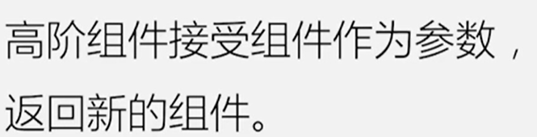

## 状态

- props
- state

### Context

### Redux 状态管理

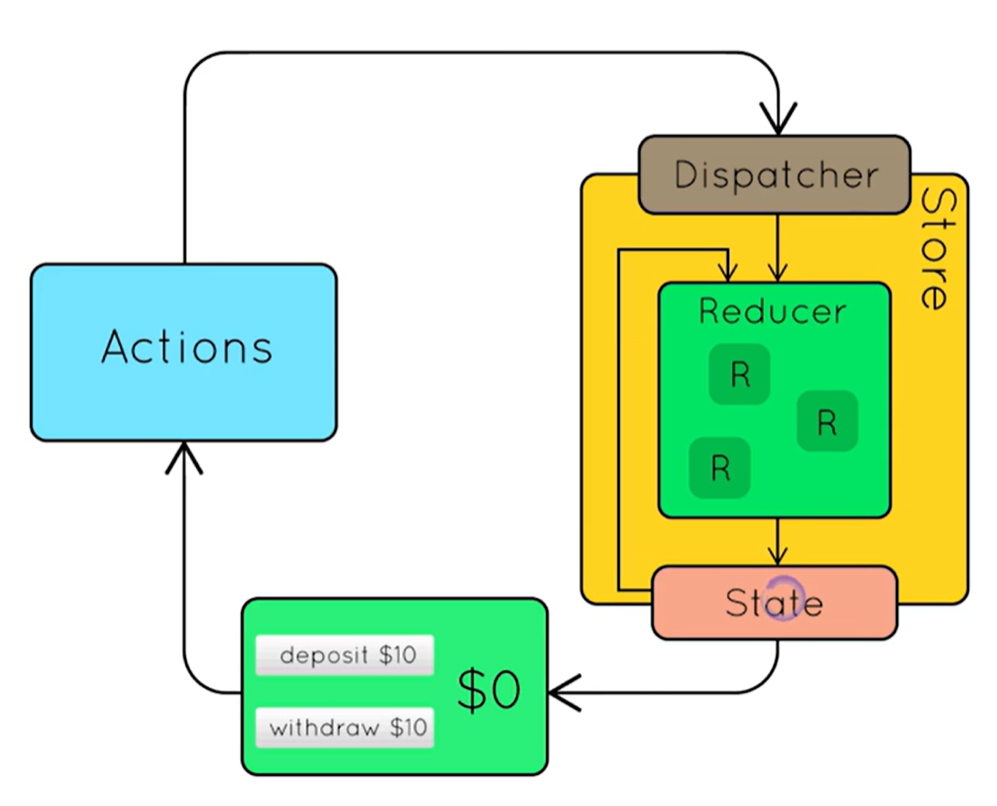

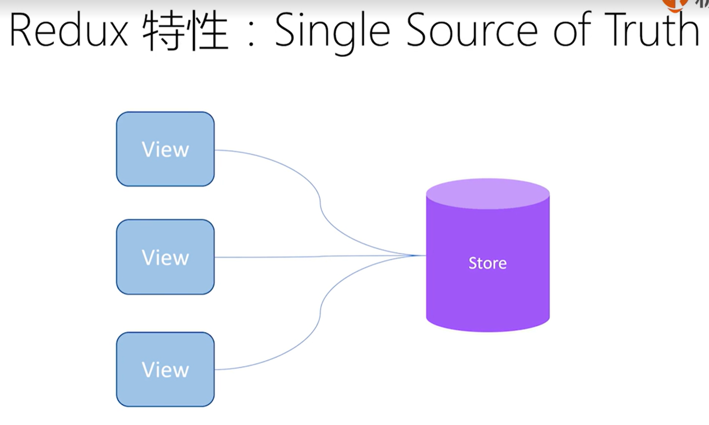

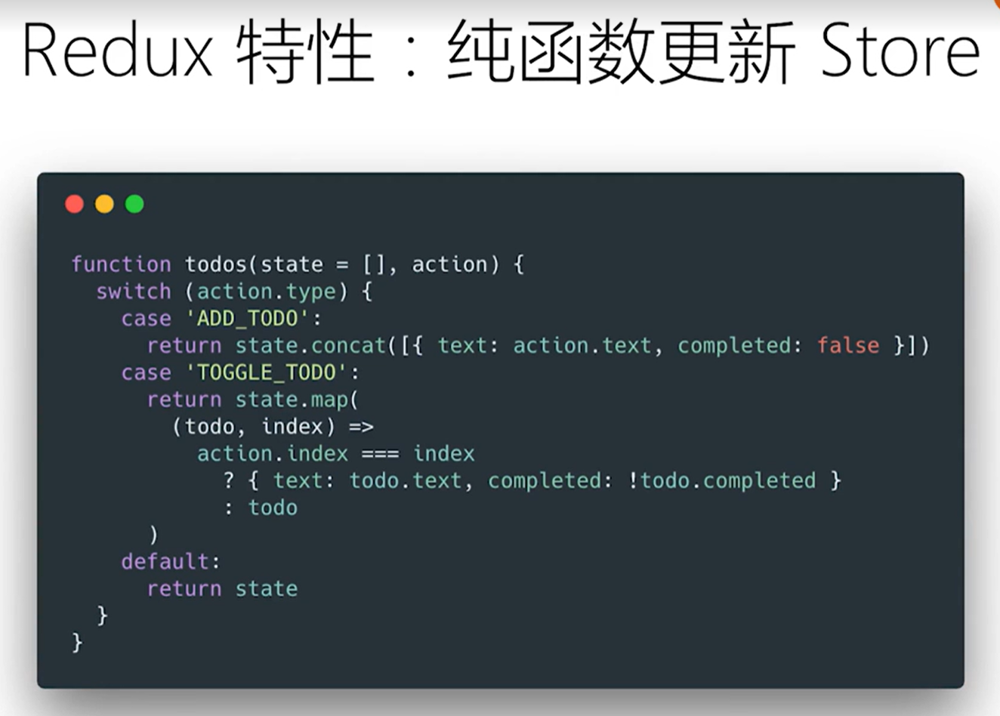

#### store

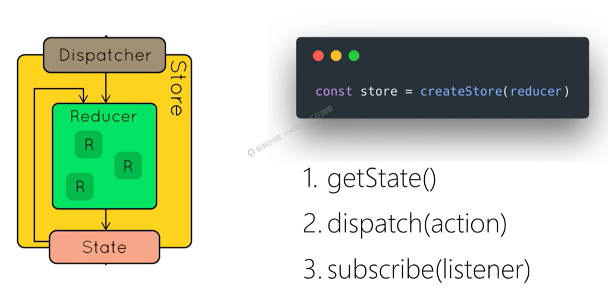

## 生命周期

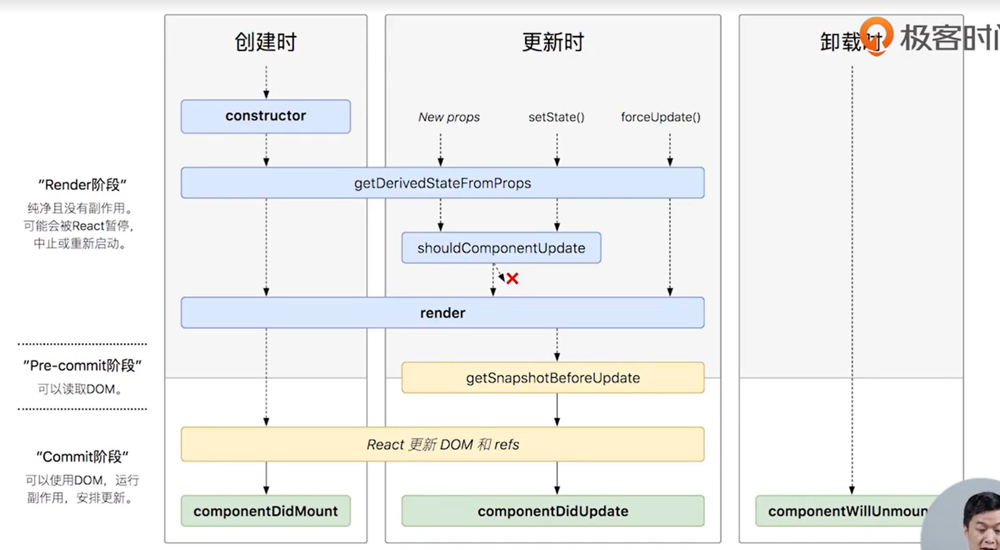

### 常用方法

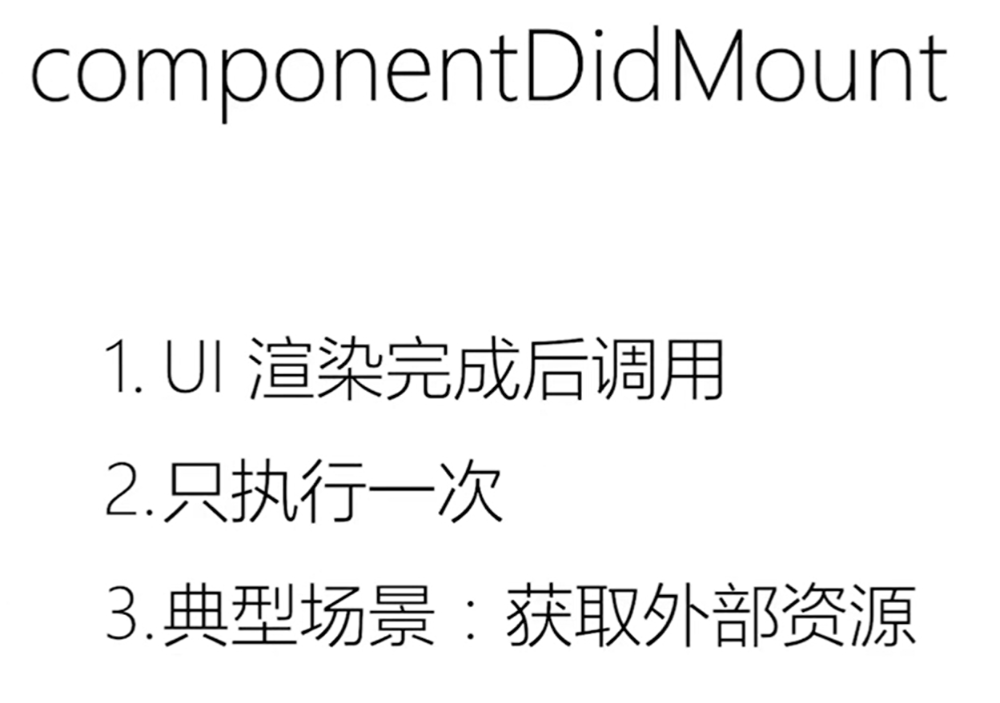
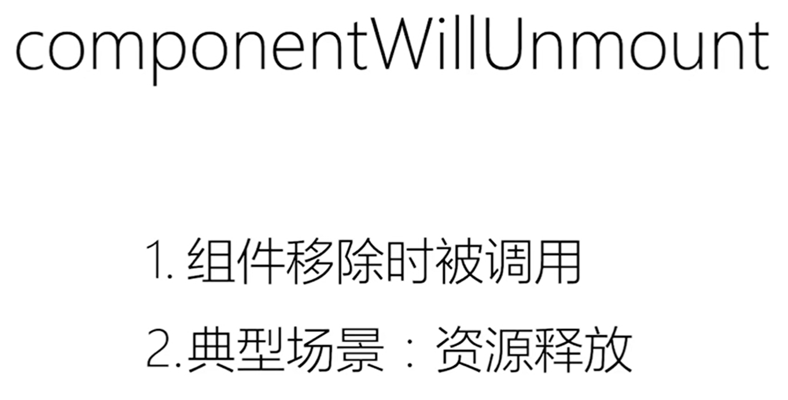
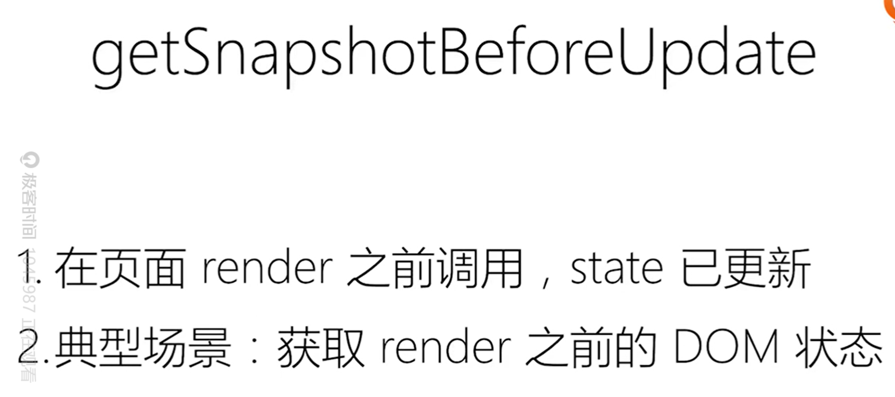
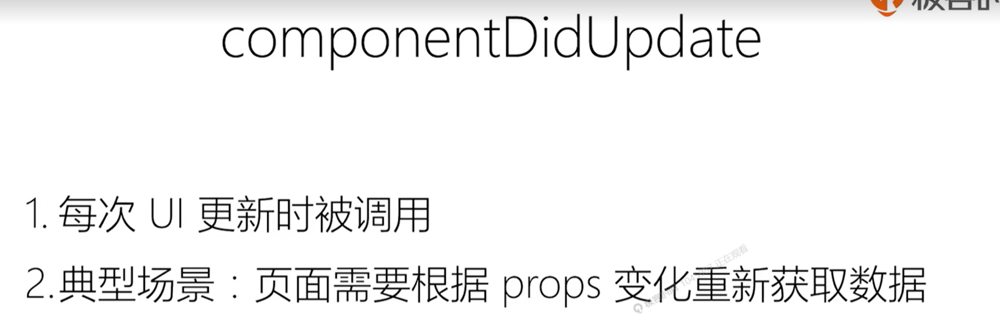
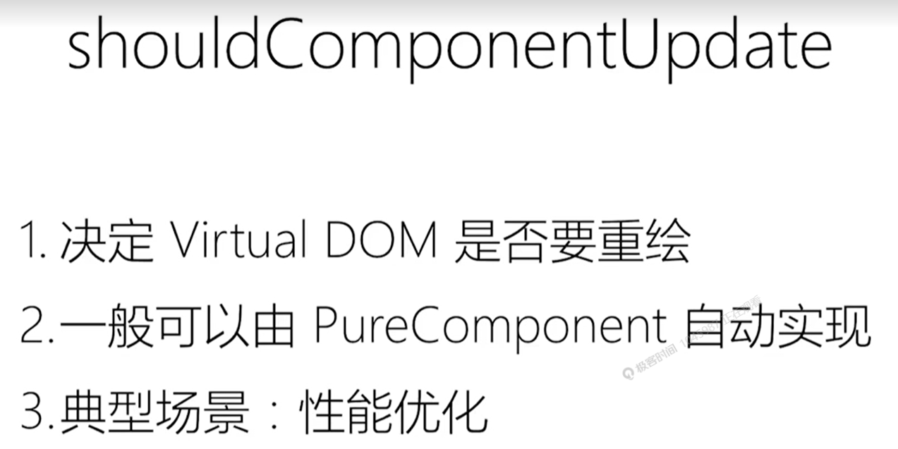

## 打包 & 部署

## Reference

- 