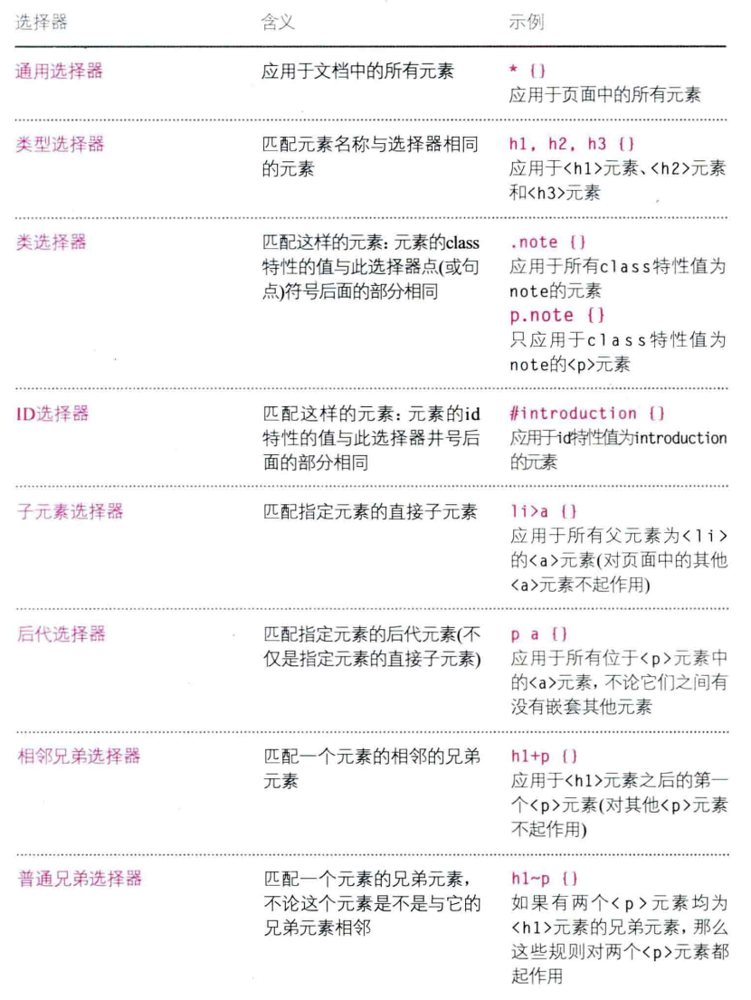

# HTML && CSS 入门

## HTML

### Form

## CSS 基本规则

可以在 css 中通过 `@import` 导入其他的样式

### CSS 选择器 selector

区分大小写

优先级：

- 就近原则，后出现的优先于之前的
- 具体性原则，具体优于一般
- 重要性，通过 `!important` 来强制指定

### 数值单位

Web 浏览器默认文本大小为 `16px`。

#### 绝对值

- px 像素

#### 相对值

- % 百分比
- em，基于父元素中的文本大小来计算

### 伪类 && 伪元素

伪元素一般在选择器的末尾处指定，为指定的元素添加新的样式。

伪类也是在在选择器的末尾处指定，为指定元素的特定状态添加新的样式。

## CSS 布局

### 盒子模型

CSS 采用盒子模型来处理每一个 HTML 元素。

- block 块级盒子, 换行显示
  - div
- inline 内联盒子，在周围文本之间流动
  - span

display 属性可用于指定一个元素为块级元素还是内联元素。

隐藏元素：

- display: none, 元素不存在 DOM 中，不占空间
- visibility: hidden, 元素隐藏在 DOM 中，占用空间，并留白

### 盒子

盒子中的常用属性：

- 大小[width/height/min-width/max-width]，默认情况下一个盒子的大小刚好容纳下其中的内容，并根据内容的变化而变化。
- 内容溢出[overflow], 指明当内容超出盒子本身时如何显示
- border，边框将一个盒子的边缘和另一个盒子隔开
  - radius，用于创建圆角
- margin 外边距
- padding 内边距
- text 相关属性会被子元素继承

盒子在页面居中 = 盒子宽度 + 盒子左右 margin 为 auto

#### 定位机制

通过 `position` 来设置定位机制。

- static 普通流，默认的定位机制
- relative 相对定位，基于普通流中的位置进行相对位置的移动，不影响其他元素。
- absolute 绝对定位，基于父元素来定位，脱离了普通流。
  - fixed 固定定位，基于窗口进行定位。
- 浮动元素，使用 `float` 让元素浮动，脱离普通流.

当盒子出现重叠时可以使用 z-index 控制哪个盒子显示在上层。

### Flex

### Grid

又被称为 960 像素网格。

## Reference

- [HTML & CSS设计与构建网站](https://book.douban.com/subject/21338365/)
- [CSS Flexbox Layout Guide](https://css-tricks.com/snippets/css/a-guide-to-flexbox/)
- [CSS Grid Layout Guide](https://css-tricks.com/snippets/css/complete-guide-grid/)