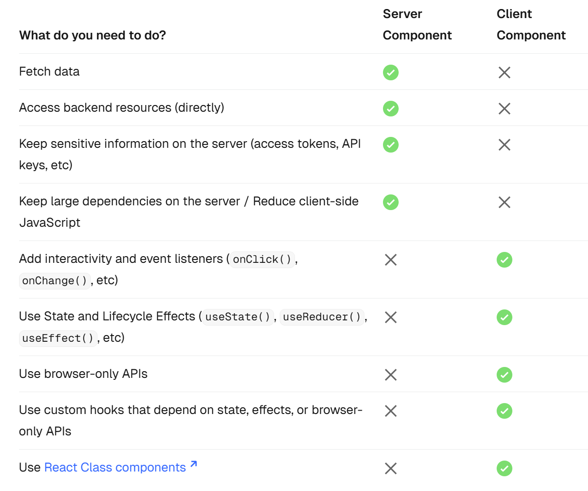

# NestJS

## App Router

## Render

### Client Component

- 文件开头需要加入 `"use client"`
- 环境变量以 `NEXT_PUBLIC` 前缀开头
- 不可以将 Server Component 直接导入使用

### Server Component

有助于 SEO 对页面的信息进行搜集

- 只包含数据以及静态页面的内容
- 使用的环境变量不以 `NEXT_PUBLIC` 前缀开头
- Streaming render，尽量让每个 page 为 Server Component，将

## Env

读取的顺序：

1. process.env
2. .env.$(NODE_ENV).local
3. .env.local (Not checked when NODE_ENV is test.)
4. .env.$(NODE_ENV)
5. .env

## Reference

