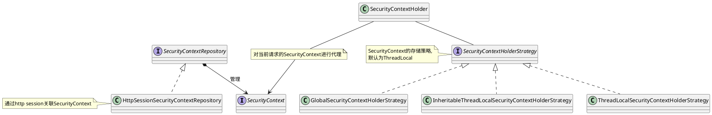

## How to Integrate with Spring

Spring Security的架构是完全基于标准的Servlet过滤器进行实现的, 
所以只要是基于Java Servlet框架就可以集成它.

整个Spring Security的入口为FilterChainProxy.

在Spring中定义名为**springSecurityFilterChain**的FilterChainProxy的bean实例, 
然后通过DelegatingFilterProxy获取它, 并将它插入到Servlet的过滤器链中.

## 过滤器链的设计

FilterChainProxy的内部维护了多个过滤器链(SecurityFilterChain), 
会按照Order注解定义的顺序, 每个SecurityFilterChain通过**RequestMatcher**对请求url进行匹配, 
并使用第一个匹配的SecurityFilterChain对请求进行处理.
所以每个SecurityFilterChain的匹配规则和顺序.

- AutowiredWebSecurityConfigurersIgnoreParents#getWebSecurityConfigurers, 
获取所有实现了**WebSecurityConfigurer接口**的SecurityFilterChain的配置
- WebSecurityConfiguration#setFilterChainProxySecurityConfigurer, 
对所有的SecurityFilterChain的配置根据Order注解进行排序, 
并加载到WebSecurity中用于生成SecurityFilterChain.
- WebSecurityConfiguration#springSecurityFilterChain, 
定义了名为**springSecurityFilterChain**的FilterChainProxy的bean实例

## 怎样配置过滤器链

Spring Security通过实现WebSecurityConfigurer接口来进行相关的配置, 
并且它提供了一个默认的抽象实现WebSecurityConfigurerAdapter, 
它主要提供了3个方面的配置:

- WebSecurityConfigurerAdapter#configure(WebSecurity), 对FilterChainProxy进行配置
- WebSecurityConfigurerAdapter#configure(HttpSecurity), 对SecurityFilterChain进行配置
- WebSecurityConfigurerAdapter#configure(AuthenticationManagerBuilder), 对认证相关进行配置

## 核心的过滤器介绍

每个SecurityFilterChain中都包含多个过滤器(Filter), 
下面是一般默认加载的Filter.

### SecurityContextPersistenceFilter

检查当前请求是否有相关的session存在, 如果存在, 则获取保存的SecurityContext;
不存在, 则创建新的SecurityContext.

在请求处理的过程中, 可以通过SecurityContextHolder来获取SecurityContext,
SecurityContext中包含了Authentication信息.

SecurityContextHolder默认将SecurityContext保存在ThreadLocal中

### LogoutFilter

处理用户的登出请求, 通过LogoutHandler实例对相关的数据进行清理, 
成功清理完成后调用LogoutSuccessHandler

### AuthenticationFilter

Authentication描述登录的认证输入信息, 
通过校验认证输入信息, 得到认证成功后的Authentication信息.
认证成功后的Authentication会被保存在SecurityContext中.

详情会在认证章节进行讨论.

### SessionManagementFilter

对刚刚认证通过的用户进行session校验, 主要针对同时登录数之类的检查.

详情会在Session章节进行讨论.

### ExceptionTranslationFilter

Spring Security中的全局异常处理, 
用于对ExceptionTranslationFilter之后的所有Filter产生的
AccessDeniedException和AuthenticationException进行捕获处理.

### FilterSecurityInterceptor

根据**在SecurityFilterChain中预先配置**的鉴权信息, 对当前请求进行校验.

详情会在认证章节进行讨论.

## Reference

- [Spring Security Architecture](https://spring.io/guides/topicals/spring-security-architecture)
- [Spring Security Reference](https://docs.spring.io/spring-security/site/docs/current/reference/html5/)